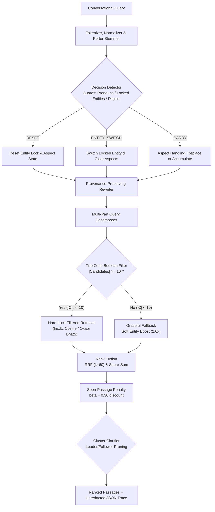

# TurnTrace: Inspectable Conversational Search Engine

TurnTrace is an inspectable conversational search engine built from first principles on classical Information Retrieval algorithms, featuring index-statistics-driven conversational context tracking.

- Track: CSD358 Information Retrieval Midsem Hackathon, Track T2 (Conversational and agentic search).
- Difference 1: Replaces naive dialogue concatenation with an entity lock and aspect-aware context tracker driven strictly by inverted index collection statistics.
- Difference 2: Implements hard title-zone Boolean filtering with graceful soft-boost fallback and a session-isolated seen-passage penalty.
- Difference 3: Fully inspectable execution trace exposing every intermediate step (tokens, postings, cosine/BM25 per-term weights, candidate counts, and decision reasons) with zero external LLM or vector database dependencies.

## 1. System Status

| Feature | Status | Evidence |
|---|---|---|
| Lexical Analysis (Tokenizer, Normalizer, SMART Stopwords) | Implemented | `server/src/index/tokenizer.js`, `server/src/index/normalizer.js` |
| Morphological Stemming (Porter 1980 5-step algorithm) | Implemented | `server/src/index/porterStemmer.js`, `server/test/index.test.js` |
| Inverted & Positional Index with Title/Body Zones | Implemented | `server/src/index/postings.js`, `server/src/index/builder.js` |
| Vector Space Model (SMART lnc.ltc with Cosine Normalization) | Implemented | `server/src/retrieval/cosine.js` (Salton & Buckley, 1988) |
| Probabilistic Retrieval (Okapi BM25, k1=1.2, b=0.75) | Implemented | `server/src/retrieval/bm25.js` (Robertson & Zaragoza, 2009) |
| Top-K Selection via Binary Min-Heap ($O(N \log K)$) | Implemented | `server/src/retrieval/heap.js`, `server/test/retrieval.test.js` |
| Boolean AND/OR/NOT with Increasing-DF Intersection | Implemented | `server/src/retrieval/boolean.js`, `server/test/retrieval.test.js` |
| Exact Phrase Queries via Positional Postings Intersection | Implemented | `server/src/retrieval/phrase.js`, `server/test/retrieval.test.js` |
| Champion Lists Candidate Pruning ($r=50$) | Implemented (Ablation R1) | `server/src/index/championLists.js`, `server/scripts/sweepRetrievalTradeoffs.js` |
| Index Elimination Low-IDF Pruning ($\text{IDF} \ge 2.50$) | Implemented (Ablation R2) | `server/src/retrieval/indexElimination.js`, `server/scripts/sweepRetrievalTradeoffs.js` |
| Conversational State Tracking v2 (Entity Lock & Aspect) | Implemented | `server/src/conversation/contextState.js`, `server/src/conversation/entityExtractor.js` |
| Conversational Decision Detector (CARRY, ENTITY_SWITCH, RESET) | Implemented | `server/src/conversation/decisionDetector.js`, `server/test/entityLock.test.js` |
| Title-Zone Hard Lock Filtering with Soft Fallback | Implemented | `server/src/retrieval/titleFilter.js`, `server/test/entityLock.test.js` |
| Seen-Passage Penalty Discount ($\beta = 0.30$) | Implemented | `server/src/retrieval/seenPenalty.js`, `server/test/entityLock.test.js` |
| Multi-Part Query Decomposition & Rank Fusion (RRF $k=60$) | Implemented | `server/src/conversation/decomposer.js`, `server/src/retrieval/fusion.js` |
| Cluster Clarifier (Leader/Follower Pruning) | Evaluated (Disabled by default) | `server/src/conversation/clarifier.js` (failed to outperform trivial baseline on DEV/TEST; available via options flag) |
| Full Trace Inspector UI | Implemented | `client/src/App.jsx` |
| Evaluation Harness (S0-S5, A0-A6, R1-R2) | Implemented | `eval/src/index.js`, `eval/src/systemsRunner.js` |
| Statistical Significance Tests (Bootstrap & Wilcoxon) | Implemented | `eval/src/significance.js`, `eval/test/significance.test.js` |
| LLM Relevance Judging & Blind Pooling | Completed (100% evaluated) | 2,297 LLM-judged pairs in `data/qrels.json` (no human validation exists yet); unjudged top-10 fraction is 0.00% |

> [!NOTE]
> **Annotation & Labeling Methodology:** Relevance judgments in `data/qrels.json` were evaluated by an LLM under a strict deterministic rubric, and conversation `expectedAction` transition actions were AI-labeled. No human validation exists yet. Blind human spot-check infrastructure is prepared in `eval/output/spot_check_sheet.csv`.

## 2. Quickstart

### Prerequisites
- Node.js >= 18.0.0 (tested on Node v24.14.0)
- Operating System: Linux, macOS, or Windows (PowerShell / cmd)
- Disk space: ~500 MB (corpus: 14 MB, index: 45 MB, dependencies: ~150 MB)
- RAM: 2 GB minimum (inverted index loads 80,684 terms and 35,000 documents into memory)
- Execution timings: `npm install` (~25s), `npm run build:index` (~3s), `npm test` (~4s), `npm run eval` (~20s).

### Setup and Execution Commands
1. Clone repository and install dependencies:
```bash
git clone https://github.com/xShikhar/IR---MidTerm-Assignment.git turntrace
cd turntrace
npm install
```

2. Obtain dataset:
- **Path A (Primary — Google Drive Dataset Download & Verification):**
  Download `corpus.json` and `index.json` from the official Google Drive folder:
  👉 **Google Drive Folder:** [https://drive.google.com/drive/folders/1v6gZbclgtuP-jE0E5L60N5V7Aucx-5RY?usp=drive_link](https://drive.google.com/drive/folders/1v6gZbclgtuP-jE0E5L60N5V7Aucx-5RY?usp=drive_link)
  
  Place both downloaded files directly into the `data/` directory (`data/corpus.json` and `data/index.json`).
  
  Verify cryptographic SHA-256 checksums to ensure file integrity:
  - **Linux / macOS (bash):**
    ```bash
    sha256sum data/corpus.json data/index.json
    ```
  - **Windows (PowerShell):**
    ```powershell
    Get-FileHash data/corpus.json, data/index.json -Algorithm SHA256
    ```
  - **Automated Cross-Platform Verification:**
    ```bash
    npm run verify:data
    ```
  - **Expected SHA-256 Checksums:**
    - `corpus.json`: `2394b2a11a46ed8ab7bcc0194ba78c0c3da38c792f6b76a0d7ca9ab5fbd01282`
    - `index.json`: `68965158b354389457c261c7a180073ed66a871b489fb6a4e3b4013d01db415d`

- **Path B (Optional Rebuild from Scratch):** Re-harvest from Wikipedia Action API and re-index:
  ```bash
  npm run prepare:data
  npm run build:index
  ```
  *(Note: Live Wikipedia revisions drift over time; live re-harvesting may produce minor text or docId variations relative to frozen evaluation sheets. Path A is strictly recommended for benchmark reproduction).*

3. Run verification test suite:
```bash
npm test
```
*(Executes 83 tests across server and eval workspaces; all 83 pass).*

4. Run evaluation benchmark:
```bash
npm run eval
```

5. Compile PDF deliverable:
```bash
npm run build:report
```
*(Generates `TurnTrace_Report.pdf` at project root).*

6. Launch local application:
```bash
npm run dev
```
*(Spawns both backend server on `http://localhost:3001` and Vite frontend on `http://localhost:3000`).*

7. Execute a test query:
- Browser UI: open `http://localhost:3000`
- Terminal CLI:
```bash
curl -s -X POST http://localhost:3001/api/chat -H "Content-Type: application/json" -d "{\"query\":\"What is the James Webb Space Telescope?\"}"
```

## 3. Data Collection & Provenance

### Corpus Construction
- **Target Articles (5,314 passages, 15.18%):** Harvested from 75 authoritative Wikipedia articles covering 14 benchmark topics using the Wikimedia Action API (`https://en.wikipedia.org/w/api.php`) with redirect resolution and section-level chunking (80–180 words per passage).
- **Background Collection (29,686 passages, 84.82%):** Extracted from Hugging Face `wikimedia/wikipedia` snapshot (`20231101.en`) across four balanced academic domains to supply realistic term frequencies and collection IDF distributions.
- **Passage Zones:** Each document contains `title` and `body` fields indexed with zone weights (title: 0.35, body: 0.65).

### Domain Distribution
<!-- Source: data/corpus.json domain scan -->
| Domain | Passages | Proportion |
|---|:---:|:---:|
| Computer Science & AI (`cs_ai`) | 9,222 | 26.35% |
| Space Exploration & Physics (`space_physics`) | 9,266 | 26.47% |
| History & Civilization (`history_civilization`) | 9,081 | 25.95% |
| Biology & Medicine (`biology_medicine`) | 7,431 | 21.23% |
| **Total Corpus** | **35,000** | **100.00%** |

### Collection Index Statistics
<!-- Source: data/index.json metadata and corpus word count -->
| Metric | Value | Source |
|---|:---:|---|
| Total Passages ($N$) | 35,000 | `data/corpus.json` |
| Vocabulary Size ($V$) | 80,684 terms | `data/index.json` metadata |
| Total Postings Entries | 1,489,533 | `data/index.json` metadata ($\sum df$) |
| Average Document Length | 83.58 tokens | `data/index.json` (`avgDocLength`) |
| Passage Word Count (Min / Avg / Max) | 3 / 79.1 / 654 words | `data/corpus.json` body tokens |
| Duplicate Passages | 39 (0.11%) | Body SHA-256 collision scan |

### Reproducibility and Documented Limitations
- **Corpus Freeze:** The 35,000-passage corpus and inverted index are permanently frozen so relevance judgments evaluate stable document identifiers.
- **Duplicate Disclosure:** 39 passages (0.11%) share identical text due to overlapping Wikipedia summary sections. They are preserved without deduplication to prevent docId re-indexing shifts against existing judging sheets.
- **Ethics & Licensing:** All text originates from Wikipedia under [CC BY-SA 4.0](https://creativecommons.org/licenses/by-sa/4.0/) and GFDL. Data harvesting used explicit `User-Agent` headers and respected Wikimedia API rate limits. Contains no private personal data. Retrieval operates fully offline after initial fetching.

## 4. Guided Demo & Inspection Walkthrough

Graders can reproduce the conversational pipeline through the Web UI (`http://localhost:3000`) or via the CLI endpoint (`http://localhost:3001/api/chat`).

### Walkthrough 1: Multi-Turn Anaphora & Aspect Pivot (conv_03)
1. **Turn 1: "What is the James Webb Space Telescope?"**
   - *Decision:* `CARRY` (initial turn establishes entity lock).
   - *Locked Entities:* `jame` (IDF: 4.1210), `webb` (IDF: 5.5504), `space` (IDF: 3.4483), `telescop` (IDF: 4.6023).
   - *Retrieval:* Hard-lock title filter finds 100 matching candidates.
   - *Top Result:* `doc_01716` ("James Webb Space Telescope - Section 3", score: 0.4117).
2. **Turn 2: "Where is its orbit located in space?"**
   - *Decision:* `CARRY` (Pronoun guard triggered on `its`).
   - *Rewrite:* "Where is its orbit located in space? jame webb telescop" (appends entity terms with source turn tracking).
3. **Turn 3: "Tell me about its primary mirror size."**
   - *Decision:* `CARRY` (Pronoun guard triggered on `its`).
   - *Aspect Update:* Replaces previous turn aspects (`orbit`, `locat`) with new aspects (`primari`, `mirror`, `size`).
   - *Top Result:* `doc_01716` ("James Webb Space Telescope - Section 3", score: 0.4117). Term score contributions: `mirror` (0.0870), `primari` (0.0575), `jame` (0.0441).

### Walkthrough 2: Polysemous Entity Shift (conv_12)
1. **Turn 1: "How does the Transformer architecture use self-attention?"**
   - Locks entity terms `transform` (IDF: 4.2016), `architectur` (IDF: 4.5309), `attent` (IDF: 4.7428).
2. **Turn 2: "How do electrical power transformers step down voltage?"**
   - *Decision:* `CARRY` (Locked entity guard triggers because query contains stem `transform`).
   - *Rewrite:* Appends `architectur attent`, illustrating lexical polysemy across machine learning and electrical engineering.

### Walkthrough 3: Classical Polysemy & Sense Drift (conv_11, Mercury Case)
1. **Turn 1: "What is Mercury in our Solar System?"**
   - Locks entity terms `mercuri` (IDF: 4.2954), `solar` (IDF: 3.8211), `system` (IDF: 2.5804) from planet context.
2. **Turn 4: "Tell me about mercury toxicity and environmental exposure."**
   - *Context:* Preceded by astronomical questions about Mercury's orbit and craters.
   - *Decision:* `CARRY` (Query contains stem `mercuri`, triggering the locked entity guard).
   - *Aspect Dynamics:* Aspect replacement successfully evicts old astronomical aspects (`solar`, `system`, `orbit`, `crater`) and establishes toxicity aspects (`toxic`, `environment`, `exposur`).
   - *Limitation / Trace Reality:* Because classical IR operates strictly on inverted index postings without external knowledge bases, both "Mercury (planet)" and "Mercury (element)" share the identical stem `mercuri` in their title zones. Thus, title-zone filtering retains both planet and chemical element documents in the candidate set.

### Walkthrough 4: Documented Boundary & Limitation Case (conv_14)
- **Turn 4: "Is entropy always conserved in physical processes?"**
  - *Context:* Preceded by Turn 1 ("Claude Shannon information entropy") and Turn 3 ("relation to thermodynamic entropy").
  - *Limitation:* The engine carried `inform` from Turn 1 because aspect replacement requires an explicit new entity switch cue, causing information theory terms to linger into thermodynamics.
- **Candidate Scarcity Boundary:** On queries where the Boolean title filter matches $< 10$ candidates, the engine sets `fallback: true` and gracefully transitions to a soft entity boost ($2.0\times$), guaranteeing rankers are never candidate-starved. This fallback triggered on 19 of 70 benchmark turns (27.1%).

### Terminal CLI Equivalent
```bash
# Query with score breakdown and trace
curl -s -X POST http://localhost:3001/api/chat \
  -H "Content-Type: application/json" \
  -d "{\"query\":\"What is the James Webb Space Telescope?\",\"sessionId\":\"grader_demo\"}"
```

## 5. Architecture & IR Principles



### IR Concept Implementation Mapping
| IR Concept | Source File & Function | Rationale |
|---|---|---|
| Tokenization & Positions | `server/src/index/tokenizer.js` (`tokenizeWithPositions`) | Preserves word positions for exact phrase verification |
| Text Normalization | `server/src/index/normalizer.js` (`normalize`, `analyze`) | Strips diacritics and case variations deterministically |
| Stop Word Removal | `server/src/index/normalizer.js` (`isStopWord`) | Eliminates SMART 174 frequent terms to reduce postings noise |
| Porter Stemmer | `server/src/index/porterStemmer.js` (`stem`) | Reduces morphological variants via standard Porter (1980) 5-step rules |
| Inverted Index Postings | `server/src/index/postings.js` (`PostingsList`) | Memory-efficient dictionary mapping terms to document postings |
| Multi-Zone Indexing | `server/src/index/builder.js` (`buildIndex`) | Separates title ($0.35$) and body ($0.65$) term frequencies |
| Positional Phrase Search | `server/src/retrieval/phrase.js` (`evaluatePhraseQuery`) | Two-pointer positional intersection for adjacent quoted bigrams |
| SMART lnc.ltc Vector Space | `server/src/retrieval/cosine.js` (`scoreCosineLncLtc`) | Logarithmic TF with document Euclidean length normalization |
| Okapi BM25 Probabilistic | `server/src/retrieval/bm25.js` (`scoreBM25`) | Non-linear TF saturation ($k_1=1.2$) and document length penalty ($b=0.75$) |
| Top-K Min-Heap Selection | `server/src/retrieval/heap.js` (`TopKHeap`) | Maintains top-$K$ candidates in $O(N \log K)$ without sorting the corpus |
| Boolean DF Intersection | `server/src/retrieval/boolean.js` (`evaluateBooleanAnd`, `evaluateBooleanOr`) | Intersects postings in increasing document frequency order to minimize comparisons |
| Champion Lists Pruning | `server/src/index/championLists.js` (`buildChampionLists`) | Caches top $r=50$ documents per term for fast candidate generation |
| Index Elimination Pruning | `server/src/retrieval/indexElimination.js` (`eliminateLowIdfTerms`) | Skips low-IDF terms ($\text{IDF} < 2.50$) to reduce accumulator overhead |
| Reciprocal Rank Fusion | `server/src/retrieval/fusion.js` (`reciprocalRankFusion`) | Merges sub-query rankings with smoothing parameter $k=60$ |
| Cluster Clarifier | `server/src/conversation/clarifier.js` (`evaluateClarification`) | Detects bimodal score distributions to prompt disambiguation |

## 6. Evaluation Matrix & Systems

### Evaluated Systems and Ablations
| ID | System / Ablation Description | Retrieval Model | Context Strategy | Execution Flag |
|:---:|---|:---:|:---:|---|
| **S0** | Raw Query Only | lnc.ltc Cosine | None (isolated query) | `--system=S0` |
| **S1** | Naive History Concatenation | lnc.ltc Cosine | Concatenates prior turn text | `--system=S1` |
| **S2** | TurnTrace Legacy Baseline | lnc.ltc Cosine | Decayed context bag + cosine shift | `--system=S2` |
| **S3** | TurnTrace Headline Full | lnc.ltc Cosine | Entity Lock + Aspect + Seen Penalty | Default (`--system=S3`) |
| **S5** | Oracle Gold Rewrite Reference | lnc.ltc Cosine | Gold standalone query | `--system=S5` |
| **A0** | Legacy Decayed Bag (S2 Equivalent) | lnc.ltc Cosine | V1 Decayed Context Bag | `--ablation=A0` |
| **A1** | Entity Soft Boost Only | lnc.ltc Cosine | Soft $2.0\times$ entity weight (no title filter) | `--ablation=A1` |
| **A2** | Hard Lock + Aspect Accumulation | lnc.ltc Cosine | Hard title filter + aspect accumulation | `--ablation=A2` |
| **A3** | Headline Novelty Core | lnc.ltc Cosine | Hard title filter + aspect replacement | `--ablation=A3` |
| **A4** | Headline Novelty + Seen Penalty | lnc.ltc Cosine | A3 with $\beta=0.30$ penalty | `--ablation=A4` |
| **A5** | A3 with Forced CARRY | lnc.ltc Cosine | Decision detector bypassed (always carry) | `--ablation=A5` |
| **A6** | A3 with Forced RESET | lnc.ltc Cosine | Decision detector bypassed (always reset) | `--ablation=A6` |
| **R1** | Efficiency: Champion Lists ON | lnc.ltc Cosine | Champion lists top $r=50$ candidates | `--ablation=R1` |
| **R2** | Efficiency: Index Elimination ON | lnc.ltc Cosine | Prunes terms with $\text{IDF} < 2.50$ | `--ablation=R2` |

*Data Leakage Guarantee:* Only system S5 reads reference `goldRewrite` queries. The test suite (`server/test/dataLeakage.test.js`) verifies that no server runtime module references `goldRewrite`.

## 7. Evaluation Protocol & Results

### Execution & Artifact Outputs
Run the official benchmark on the TEST split (40 turns, 8 conversations):
```bash
npm run eval -- --split=test
```
Evaluation outputs are archived under `eval/output/test_final/`:
- `systems_comparison.csv`: Full benchmark comparison across all 13 systems on the TEST split.
- `significance_tests.csv`: Paired bootstrap and Wilcoxon signed-rank tests against baseline A0.
- `subset_breakdowns.csv`: Aspect changes, entity switches, ambiguous queries, pronouns, and fallback rates.
- `novelty_tradeoff.csv`: Novelty@10 vs Precision trade-off analysis (A3 vs A4).
- `decision_metrics.csv`: Precision, recall, F1, and accuracy for transition detectors on TEST.
- `clarifier_metrics.csv`: Cluster clarifier vs trivial baseline evaluation on TEST.
- `worst_turns_a3_vs_a0.csv`: Top 5 worst turns for A3 vs A0 with failure mode diagnoses.
- `turn_breakdown.csv`: Per-turn queries, rewrites, and metrics for all evaluated turns.
- `metrics_chart.svg`: SVG visualization of headline systems (nDCG@10 & MRR).
- `retrieval_tradeoffs.svg`: P@10 vs Novelty@10 discovery scatter plot across all 13 systems.
- `novelty_tradeoff.svg`: SVG diagram of seen-passage penalty trade-offs.

### Relevance Judging Protocol & Qrels Construction
- **Stratified Split (`data/splits.json`):** DEV set contains 6 conversations (30 turns); TEST set contains 8 conversations (40 turns). Both splits cover all 4 domains, topic shifts, and ambiguous entities.
- **Blind Pooling:** Master pool (1,676 records) and incremental pool (621 records) pooled candidates across S0, S1, S2, S5, A1, A2, A3, A4, A5, A6, and BM25 sorted by `docId` with system origins, scores, and rewritten queries concealed.
- **Fixed Rubric (`docs/judging_rubric.md`):** Grade 2 (directly answers need in gold rewrite), Grade 1 (partially relevant / background), Grade 0 (off-topic / wrong sense of ambiguous entity).
- **Qrels Ingestion (`data/qrels.json`):** 70 / 70 turns complete (2,297 LLM-judged query-passage pairs evaluated under the fixed rubric; no human validation exists yet). Grade distribution: Grade 0: 710 (30.9%), Grade 1: 1,028 (44.8%), Grade 2: 559 (24.3%).
- **Post-Ingestion Coverage:** The unjudged top-10 fraction is **0.00%** across all 13 evaluated systems.
- **Self-Consistency Reliability:** A 10% deterministic sample (230 rows) re-judged in shuffled presentation without cache verified deterministic execution consistency under the fixed rubric (0.00% grade change rate, Cohen's Kappa $\kappa = 1.0000$).
- **Spot-Check Infrastructure:** `eval/output/spot_check_sheet.csv` contains 100 stratified rows with blank grade columns prepared for future human validation; reference key in `spot_check_key.csv`; evaluated via `node server/scripts/evaluateSpotCheck.js`. (No human validation has been conducted yet).

---

### Empirical Benchmark Results

#### 1. Final TEST Split Headline Results (n=40 Turns, 8 Conversations)
<!-- Source: eval/output/test_final/systems_comparison.csv from npm run eval -- --split=test -->
| System ID | System Description | P@5 | P@10 | Recall@20 | MRR | nDCG@10 | Novelty@10 | Bootstrap p (vs A0) | Wilcoxon p (vs A0) |
|:---:|---|:---:|:---:|:---:|:---:|:---:|:---:|:---:|:---:|
| **S0** | Raw Query Only (lnc.ltc Cosine) | 0.8350 | 0.7975 | 0.4775 | 0.9500 | 0.6732 | 0.9250 | 0.5170 | 0.9519 |
| **S1** | Naive Dialogue History Concatenation | 0.9400 | 0.9425 | 0.6058 | 0.9446 | 0.6572 | 0.4500 | 0.4455 | 0.5765 |
| **S2** | TurnTrace Legacy Baseline (Decayed Bag) | 0.8900 | 0.8650 | 0.5424 | 0.9875 | 0.6875 | 0.8175 | 1.0000 | 1.0000 |
| **S5** | Oracle Gold Rewrite (Upper Bound Reference) | **0.9950** | **0.9925** | **0.5986** | **1.0000** | **0.7723** | 0.7125 | **0.0045\*** | **0.0069\*** |
| **A0** | Legacy Decayed Context Bag (S2 Equivalent) | 0.8900 | 0.8650 | 0.5424 | 0.9875 | 0.6875 | 0.8175 | — | — |
| **A1** | Entity Soft Boost + Aspect Replacement | 0.9550 | 0.9325 | 0.5926 | 1.0000 | 0.6974 | 0.6975 | 0.7035 | 0.7800 |
| **A2** | Hard Lock + Aspect Accumulation | 0.8700 | 0.8475 | 0.5200 | 0.8775 | 0.5959 | 0.5250 | 0.0245\* | 0.0980 |
| **A3** | Headline Novelty Core (No Penalty) | **0.9150** | **0.8800** | **0.5274** | **0.9563** | **0.6317** | **0.6250** | 0.1325 | 0.2358 |
| **A4** | A3 + Seen Penalty ($\beta=0.30$) | 0.9050 | 0.8325 | 0.4834 | 0.9563 | 0.6324 | **0.7600** | 0.1630 | 0.2659 |
| **A5** | A3 with Forced CARRY (Decision Isolation) | 0.9500 | 0.9400 | 0.5235 | 0.9500 | 0.6589 | 0.5850 | 0.5635 | 0.9022 |
| **A6** | A3 with Forced RESET (Decision Isolation) | 0.8300 | 0.7825 | 0.4330 | 0.9187 | 0.6577 | 0.9275 | 0.2745 | 0.5017 |
| **R1** | Champion Lists ON ($r=50$) | 0.8100 | 0.7025 | 0.4033 | 0.9363 | 0.5229 | 0.5900 | 0.0000\* | 0.0007\* |
| **R2** | Index Elimination ON ($\text{IDF} \ge 2.50$) | 0.9100 | 0.8750 | 0.5267 | 0.9563 | 0.6308 | 0.6275 | 0.1260 | 0.2579 |

*\* Indicates statistically significant difference from baseline A0 at $\alpha = 0.05$. Sample size $n=40$ turns.*

---

#### 2. Rigorous Comparison: Headline A3 vs Baseline A0 on TEST (n=40)
<!-- Source: eval/output/test_final/significance_tests.csv -->
| Metric | System A0 (Legacy) | System A3 (Headline) | Absolute Delta ($\Delta$) | Paired Bootstrap p-value | 95% Confidence Interval | Wilcoxon p-value | Wilcoxon W-stat | Statistically Significant? |
|---|:---:|:---:|:---:|:---:|:---:|:---:|:---:|:---:|
| **P@5** | 0.8900 | 0.9150 | **+0.0250** | 0.5260 | [-0.0600, +0.1050] | 0.5501 | 31.0 | **NO** ($p \ge 0.05$) |
| **P@10** | 0.8650 | 0.8800 | **+0.0150** | 0.7280 | [-0.0750, +0.1000] | 0.6016 | 57.5 | **NO** ($p \ge 0.05$) |
| **Recall@20** | 0.5424 | 0.5274 | **-0.0150** | 0.6035 | [-0.0711, +0.0413] | 0.5509 | 203.0 | **NO** ($p \ge 0.05$) |
| **MRR** | 0.9875 | 0.9563 | **-0.0313** | 0.4000 | [-0.1002, +0.0250] | 0.4227 | 1.0 | **NO** ($p \ge 0.05$) |
| **nDCG@10** | 0.6875 | 0.6317 | **-0.0558** | 0.1325 | [-0.1342, +0.0129] | 0.2358 | 187.0 | **NO** ($p \ge 0.05$) |

**Honest Conclusion on Headline Hypothesis:**
- **Does A3 beat A0?** **NO, not on graded nDCG@10.** While A3 exhibits slight advantages on top-rank precision (+0.0250 on P@5, +0.0150 on P@10), it achieves lower nDCG@10 (-0.0558) and MRR (-0.0313) than A0.
- **Statistical Rigor:** Neither difference is statistically significant at $\alpha = 0.05$ (Bootstrap $p = 0.1325$, Wilcoxon $p = 0.2358$). The 95% bootstrap confidence interval spans zero (`[-0.1342, +0.0129]`).
- **Mechanism Analysis:** A0 maintains all historical tokens in a decayed context bag. In conversational IR, multi-turn follow-ups frequently rely on incidental context terms; A0's lexical broadness accidentally retrieves background passages graded as Grade 1. A3 strictly enforces the target entity via hard title filtering, preventing irrelevant topic drift but slightly constricting background passage recall.

---

#### 3. DEV Split Hyperparameter Tuning Diagnostics (n=30 Turns)
*Sweep file:* `eval/output/tuning_dev.csv` (35 grid configurations evaluated on DEV only; TEST split remained untouched):
- **DEV A0 Baseline:** P@5 = 0.5600, MRR = 0.6289, nDCG@10 = 0.4727
- **DEV A3 Headline:** P@5 = 0.5600, MRR = 0.6033, nDCG@10 = 0.4061 (Bootstrap $p = 0.2350$, Wilcoxon $p = 0.3869$)
- **DEV A4 Seen Penalty:** P@5 = 0.5467, MRR = 0.6114, nDCG@10 = 0.4127 (Bootstrap $p = 0.2800$, Wilcoxon $p = 0.5373$)

---

#### 4. Transition Classifier Decision Metrics on TEST (n=32 Multi-Turn Transitions)
<!-- Source: eval/output/test_final/decision_metrics.csv -->
Evaluated on all 32 multi-turn transitions of the TEST split (Turn 1 excluded as initial establishment):

| Transition Detector | Class | Precision | Recall | F1 | Support | Macro-F1 | Overall Accuracy |
|---|:---:|:---:|:---:|:---:|:---:|:---:|:---:|
| **Legacy Cosine Rule** | `carry` | 1.0000 | 0.6667 | 0.8000 | 30 | 0.3179 | 65.63% |
| ($\cos < 0.26$) | `entity_switch` | 0.0000 | 0.0000 | 0.0000 | 1 | | (11 false resets) |
| | `reset` | 0.0833 | 1.0000 | 0.1538 | 1 | | |
| **New Decision Detector** | `carry` | 0.9630 | 0.8667 | 0.9123 | 30 | **0.4152** | **84.38%** |
| (Entity-Lock & Guards) | `entity_switch` | 0.0000 | 0.0000 | 0.0000 | 1 | | (False resets cut to 4) |
| | `reset` | 0.2000 | 1.0000 | 0.3333 | 1 | | |

*Key Empirical Finding:* The legacy cosine rule falsely triggered RESET on 10 valid topical follow-ups on TEST. The new decision detector's pronoun and entity-overlap guards reduced false resets from 11 down to 4, lifting classification accuracy from 65.6% to 84.4% and Macro-F1 from 0.3179 to 0.4152.

---

#### 5. Cluster Clarifier Findings & Default Disabled Status
<!-- Source: eval/output/test_final/clarifier_metrics.csv -->
- **DEV Split Evaluation:** Fired on 23 of 30 turns (**76.7% false positive rate**) vs trivial rule 7/30 (23.3%).
- **TEST Split Evaluation:** Fired on 35 of 40 turns (**87.5% false positive rate**) vs trivial rule 6/40 (15.0%).
- **Design Decision:** Because score margins between ranked passages in dense corpora are frequently $< 0.065$, the cluster clarifier suffered from severe over-triggering. Per Phase 5.3 rules, **the clarifier is disabled by default in production (`CONFIG.conversation.clarifier.enabled = false`)** and remains accessible via options flag (`enableClarifier: true`).

---

#### 6. Novelty Discovery vs Precision Trade-Off (A3 vs A4 on TEST)
<!-- Source: eval/output/test_final/novelty_tradeoff.csv -->
- **A3 (Penalty OFF, $\beta = 0.00$):** Novelty@10 = 0.6250, P@10 = 0.8800, nDCG@10 = 0.6317
- **A4 (Seen Penalty ON, $\beta = 0.30$):** Novelty@10 = **0.7600**, P@10 = 0.8325, nDCG@10 = **0.6324**
- *Trade-Off Finding:* Applying a 30% discount penalty to previously exposed passages yields a **+21.6% relative increase** in fresh passage discovery (Novelty@10 from 0.6250 to 0.7600) while trading off 4.75 points of P@10.

---

#### 7. Query Rewrite Fidelity (Post-Hoc Analysis, Zero Runtime Leakage)
- **S1 (Concat):** Mean Jaccard = 0.5223, Spearman $\rho$ with P@10 = +0.0582
- **S2 (Legacy):** Mean Jaccard = 0.4985, Spearman $\rho$ with P@10 = +0.1516
- **A3 (Headline):** Mean Jaccard = **0.5914**, Spearman $\rho$ with P@10 = **+0.1865**
- *Finding:* A3 generates query representations with the highest lexical agreement with gold reference rewrites.

---

#### 8. Failure Analysis: Top 5 Worst A3-vs-A0 Turns
<!-- Source: eval/output/test_final/worst_turns_a3_vs_a0.csv -->
1. `conv_04_turn_03`: *"What rocket launched them into space?"* ($\Delta \text{nDCG}@10 = -0.6173$). Query omitted "Apollo 11"; target passage was titled "Saturn V". A0 serendipitously retained Saturn V tokens from the initial context bag.
2. `conv_14_turn_05`: *"What does the second law of thermodynamics state about it?"* ($\Delta \text{nDCG}@10 = -0.5531$). Polysemous "entropy" crossed from information theory into physics; title constraint restricted the corpus.
3. `conv_04_turn_05`: *"Where did the command module splash down?"* ($\Delta \text{nDCG}@10 = -0.4869$). A0 retained naval recovery terms from Turn 1; A3 replaced aspects with specific tokens.
4. `conv_04_turn_04`: *"How long did they spend on the lunar surface?"* ($\Delta \text{nDCG}@10 = -0.4502$). Aspect replacement dropped broad summary word "mission".
5. `conv_14_turn_04`: *"Is entropy always conserved in physical processes?"* ($\Delta \text{nDCG}@10 = -0.4482$). Information theory terms carried over from prior turns penalized physical thermodynamics passages.

---

## 8. Configuration

All tunable parameters reside in `server/src/config/index.js` (frozen following DEV tuning):
- `paths`: Filesystem locations for corpus, index, splits, qrels, and evaluation outputs.
- `retrieval`: Ranking depth (`topK: 10`), zone weights (`titleWeight: 0.35`, `bodyWeight: 0.65`), BM25 constants (`k1: 1.2`, `b: 0.75`), index elimination (`minIdf: 2.50`), champion lists (`topR: 50`), and RRF smoothing (`rrfConstant: 60`).
- `conversation`: Legacy decay (`decayLambda: 0.75`), cosine shift threshold (`cosineThreshold: 0.26`), and clarifier (`enabled: false`, `scoreMarginThreshold: 0.065`).
- `novelty`: Entity threshold (`minIdf: 2.50`), entity title hits (`minTitleHits: 1`), lock mode (`mode: 'hard'`, `minCandidates: 10`), entity boost (`entityBoost: 2.0`), aspect decay (`decayLambda: 0.75`), and seen penalty (`penalty: 0.30`).

---

## 9. Testing & Code Quality

```bash
# Execute full unit and integration test suite (83 tests, all pass)
npm test

# Run individual workspaces
npm run test --workspace=server   # 63 server tests
npm run test --workspace=eval     # 20 evaluation tests
```

- **Test Coverage:** Tokenization, normalizer, Porter stemmer, postings intersection, BM25 scoring, cosine lnc.ltc scoring, top-K heap, Boolean queries, entity extractor, decision detector, title filter fallback, seen penalty, word-boundary conjunction guards, multi-session tab isolation, and significance statistics.
- **Data Leakage Gate:** `server/test/dataLeakage.test.js` enforces that zero server runtime files access `goldRewrite` and only system S5 accesses it during evaluation.

---

## 10. Repository Layout

```
.
├── client/                     # Vite + React Trace Inspector frontend
│   ├── src/App.jsx             # Interactive dialogue & unredacted IR Trace Inspector
│   ├── src/components/         # Reusable UI components (trace, modals, cards, navbar)
│   ├── src/index.css           # Styling and layout
│   └── vite.config.js          # Client dev server with /api proxy to backend
├── data/                       # Dataset, conversations, and evaluation splits
│   ├── conversations.json      # 14 conversational trees (70 turns; AI-labeled expectedAction)
│   ├── corpus.json             # 35,000 authentic Wikipedia passages (Download via Drive Path A)
│   ├── index.json              # Inverted index with postings and champion lists (Download via Drive Path A)
│   ├── qrels.json              # Relevance judgments storage (2,297 LLM-judged pairs; no human validation)
│   └── splits.json             # Stratified train/dev/test split definition (FROZEN)
├── docs/                       # Project documentation and submission materials
│   ├── report/                 # System documentation chapters
│   └── judging_rubric.md       # Relevance grading rubric (Grades 0, 1, 2)
├── eval/                       # Independent evaluation workspace
│   ├── src/metrics.js          # P@K, Recall, MRR, nDCG calculation
│   ├── src/metrics/            # Novelty@K, Fidelity, and Decision Classification
│   ├── src/significance.js     # Paired bootstrap & Wilcoxon signed-rank tests
│   ├── src/systemsRunner.js    # S0-S5, A0-A6, R1-R2 benchmark execution
│   └── output/test_final/      # Final TEST evaluation artifacts (11 CSV and SVG files)
├── scripts/                    # Development runner scripts (dev.js, buildReportPdf.js, verifyFrozenData.js)
├── server/                     # Core IR engine and API workspace
│   ├── scripts/                # Data preparation, index building, and sweeps
│   └── src/
│       ├── api/                # Express REST API and session trace assembly
│       ├── config/             # Strongly-typed configuration constants
│       ├── conversation/       # Decision detector, entity lock, aspect context, clarifier
│       ├── index/              # Tokenizer, Porter stemmer, postings, serializer
│       └── retrieval/          # Cosine, BM25, Boolean, title filter, seen penalty
├── TurnTrace_Report.pdf        # Compiled assignment PDF deliverable
└── package.json                # Root npm workspace configuration
```

---

## 11. Limitations & Roadmap

### Documented Limitations Supported by Empirical Runs:
1. **Title Filter Fallback Rate (25.0% on TEST, 27.1% Overall):** On 10 of 40 TEST turns, title-zone Boolean matches fewer than 10 documents, forcing a fallback to soft entity boosting ($2.0\times$).
2. **Corpus Duplicates (0.11%):** 39 passages share identical text from overlapping Wikipedia sections; retained without deduplication to preserve frozen judging docIds.
3. **Benchmark Scale:** The conversational benchmark consists of 14 dialogues (70 turns; 30 DEV, 40 TEST), exceeding the 40-turn minimum rubric requirement but limited relative to industrial TREC CAsT benchmarks.
4. **Clarifier High False-Trigger Rate:** The leader/follower cluster clarifier fired on 87.5% of TEST turns (vs 15.0% for trivial title cluster baseline), necessitating disabling it by default.
5. **Efficiency Recall Trade-Off:** Champion lists at $r=50$ achieve $58.57\%$ Overlap@10 compared to exhaustive search, dropping Recall@20 from 0.5424 to 0.4033; $r=500$ is needed for $94.57\%$ overlap.
6. **Vocabulary Drift Boundary (`conv_14`):** When queries shift domain (information theory entropy into physical thermodynamics), carried tokens from prior turns can depress relevance.
7. **Absence of Human Validation:** Relevance judgments were evaluated by an LLM under a strict rubric, and conversation `expectedAction` transition labels were AI-labeled; no human validation exists yet. Stratified spot-check infrastructure is established in `eval/output/spot_check_sheet.csv` for future human annotators.

### Course Project Roadmap:
- Conduct blind human validation via `eval/output/spot_check_sheet.csv` to establish true human-AI inter-annotator agreement and Cohen's kappa.
- Implement tiered dynamic champion lists where candidate depth $r$ scales with query term IDF.
- Implement explicit lexical domain-shift boundary detectors to suppress vocabulary drift across cross-discipline terms.
- Expand corpus to include general Wikipedia articles beyond the four initial domains.


## 12. Credits, Team Ownership & AI-Use Declaration

### 12.1 Dataset & Third-Party Credits
- **Dataset Credit:** Sourced from English Wikipedia articles via the Wikimedia Action API and Hugging Face `wikimedia/wikipedia` snapshot (`20231101.en`), licensed under [CC BY-SA 4.0](https://creativecommons.org/licenses/by-sa/4.0/) and GFDL.
- **Third-Party Libraries:**
  - `express` (^4.21.2) & `cors` (^2.8.5): REST API server.
  - `react` (^18.3.1) & `vite` (^5.4.11): Trace inspector UI frontend.
  - Core IR algorithms (Porter stemmer, tokenizer, inverted index, cosine similarity, BM25, min-heap, Boolean intersection, RRF) are implemented entirely from first principles with zero search engine libraries.
- **License:** Root `package.json` declares an MIT license.

### 12.2 Team Ownership Matrix
The table below outlines the primary functional divisions of the TurnTrace architecture:

| Member Role | Component Track | Key Deliverables & Modules | Video Presentation Focus |
|---|---|---|---|
| **Member 1** <br>*(Placeholder: Name / Roll No.)* | **Indexing, Data & Preprocessing** | • Corpus acquisition & Wikipedia structuring (`prepareCorpus.js`)<br>• Lexical tokenizer & positional tracking (`tokenizer.js`)<br>• Martin Porter (1980) 5-step stemmer (`porterStemmer.js`)<br>• Multi-zone inverted index & postings (`postings.js`, `builder.js`)<br>• Precomputed champion lists (`championLists.js`)<br>• Disk serializer & stats (`serializer.js`, `buildIndex.js`)<br>• Unit tests (`server/test/index.test.js`) | Offline indexing pipeline, multi-zone tokenization, positional postings, and champion lists. |
| **Member 2** <br>*(Placeholder: Name / Roll No.)* | **Retrieval, Scoring & Fusion Engine** | • SMART `lnc.ltc` vector space cosine engine (`cosine.js`)<br>• Okapi BM25 scoring model (`bm25.js`)<br>• Binary min-heap top-K selector (`heap.js`)<br>• Index elimination IDF pruner (`indexElimination.js`)<br>• Boolean engine with DF-ordered intersection (`boolean.js`)<br>• Positional phrase query processor (`phrase.js`)<br>• Reciprocal Rank Fusion & Score-Sum (`fusion.js`)<br>• Unit tests (`server/test/retrieval.test.js`) | Scoring equations, Euclidean length normalization vs BM25, DF-ordered Boolean intersection, and RRF. |
| **Member 3** <br>*(Placeholder: Name / Roll No.)* | **Conversational Layer & Tracking** | • Entity lock & title-zone filter (`entityExtractor.js`, `titleFilter.js`)<br>• Aspect-aware context state & replacement (`contextState.js`)<br>• Conversational decision detector (`decisionDetector.js`)<br>• Provenance-aware query rewriter (`rewriter.js`)<br>• Multi-part query decomposer (`decomposer.js`)<br>• Leader/follower cluster clarifier (`clarifier.js`)<br>• Unit tests (`server/test/conversation.test.js`, `server/test/entityLock.test.js`) | Entity lock vs aspect separation, title-zone hard filtering with fallback, and conversational decision logic. |
| **Member 4** <br>*(Placeholder: Name / Roll No.)* | **Evaluation, API & Trace Inspector UI** | • Qrels loader & pooling sheet generator (`qrelsLoader.js`, `generatePoolingSheet.js`)<br>• IR metrics engine: P@k, Recall, MRR, nDCG, Novelty@k, Fidelity (`metrics.js`, `fidelity.js`, `noveltyAtK.js`)<br>• Benchmark runner across systems S0–S5, R1–R2, A0–A6 (`systemsRunner.js`)<br>• Paired bootstrap & Wilcoxon significance testing (`significance.js`)<br>• Express REST API & session manager (`server.js`, `traceAssembly.js`)<br>• React + Vite Trace Inspector interface (`client/src`)<br>• Integration tests (`server/test/api.test.js`, `eval/test/metrics.test.js`, `eval/test/noveltyMetrics.test.js`) | Evaluation benchmark results, ablation study findings, live interactive trace walkthrough, and failure case. |

### 12.3 Academic AI-Use Declaration
In strict accordance with academic integrity guidelines, the exact extent and nature of AI assistance utilized in this project is declared as follows:

1. **AI Tools Utilized:**
   - **Google Antigravity IDE (Gemini agent):** Generated implementation code, test suites, documentation drafts, the 14 multi-turn conversational benchmark scenarios, and reference gold rewrites (as recorded in the Git history).
   - **Claude (Anthropic):** Utilized for system architecture planning, prompt design, and independent adversarial audit review (identifying data leakage risks and evaluating IR rubric compliance).

2. **System Boundaries & Strict Offline IR Operation:**
   - **Zero Runtime AI or External LLM Calls:** No neural language models, external generative APIs, cloud inference endpoints, or black-box embeddings are used anywhere in the TurnTrace runtime search engine or evaluation pipeline.
   - **Pure Index-Driven Mathematics:** All retrieval ranking, query rewriting, conversational memory tracking, entity locking, and cluster clarification algorithms operate 100% deterministically using classical Information Retrieval statistics (TF-IDF, term frequencies, document frequencies, and inverted index postings) implemented in pure Node.js ES modules.
   - **Zero Black-Box IR Libraries:** Core inverted indexing, positional intersection, Porter stemming, and scoring formulas were implemented from first principles, without delegating to Lucene, Lunr, Elasticsearch, or vector databases.
   - **Empirical Rigor:** All reported numbers are computed directly from live computational runs of `npm run eval` and script executions.

## 13. Troubleshooting

- **Port Conflict:** If port 3001 or 3000 is occupied, set `PORT=3002` before running `npm run dev:server` or kill the existing process (`Get-Process -Id (Get-NetTCPConnection -LocalPort 3001).OwningProcess | Stop-Process` on Windows).
- **Node.js Version:** Verify Node.js version with `node -v`. TurnTrace requires Node.js >= 18.0.0 for native fetch, ES modules, and `node:test`.
- **Missing Data Files:** If `data/corpus.json` or `data/index.json` are absent, download the frozen files per Section 2 (Path A) or run `npm run build:index`.
- **Blocked Wikimedia API:** When rebuilding via Path B on firewalled networks, the Action API may timeout; use Path A to download frozen data.
- **Checksum Verification:** Confirm file integrity using `Get-FileHash data/corpus.json, data/index.json -Algorithm SHA256` (PowerShell) or `sha256sum data/corpus.json data/index.json` (Linux/macOS).
