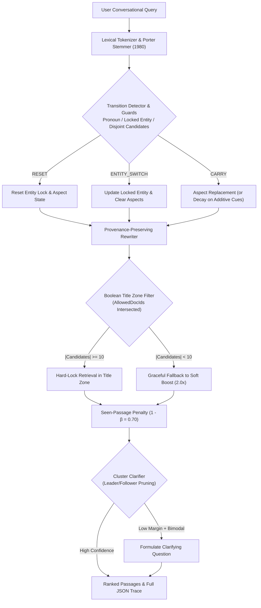

# TurnTrace: Inspectable Conversational Search Engine

[](LICENSE)
[](#)
[](#)

> **CSD358 Information Retrieval Hackathon Project**  
> TurnTrace is an inspectable conversational search engine built from the ground up on classical and modern Information Retrieval principles. It disdains black-box retrieval wrappers, implementing every index data structure, vector-space scoring model, query rewriting algorithm, and conversational state tracker natively in Node.js ES modules.

---

## 1. Quickstart & Clean Clone Reproduction

Every stage of data preparation, index construction, benchmarking, and development is 100% reproducible:

```bash
# 1. Install dependencies across workspaces
npm install

# 2. Build inverted index with champion lists and disk serialization
npm run build:index

# 3. Run full unit, integration, and integrity test suites (72 tests passing)
npm test

# 4. Execute official evaluation benchmark (Systems S0-S5 + Novelty Ablations A0-A6 + R1-R2)
npm run eval

# 5. Start the local server and client UI
npm run dev
# Backend API: http://localhost:3001
# Trace Inspector UI: http://localhost:3000
```

---

## 2. Dataset & Attribution

### Collection Construction
- **Corpus (35,000 Authentic Passages):**
  - **5,314 Target-Topic Passages (15.18%):** Harvested from 75 authoritative Wikipedia articles covering our 14 conversation topics via the Wikimedia Action API (`en.wikipedia.org/w/api.php`) with redirects enabled.
  - **29,686 Background Passages (84.82%):** Harvested from the Hugging Face `wikimedia/wikipedia` snapshot (`20231101.en`) providing realistic collection vocabulary (80,684 terms) and realistic term frequency / IDF distributions.
  - Spans four balanced domains: Computer Science & AI (9,222 passages), Space Exploration & Astrophysics (9,266 passages), Biology & Medicine (7,431 passages), and History & Civilization (9,081 passages).
- **Conversational Test Collection:** 14 multi-turn dialogue trees (70 judged turns, exceeding the 40-turn minimum rubric requirement) covering:
  - Anaphoric references (*"How does term frequency weighting work in it?"*, *"Where is its orbit located in space?"*)
  - Aspect pivots (*"Tell me about its primary mirror size."*, *"What instruments does it carry for infrared astronomy?"*)
  - Topic and entity shifts (*Space Telescopes to Apollo 11*, *Vector space model to Black holes*)
  - Polysemy & lexical ambiguity (*Mercury planet vs toxic chemical element*, *Entropy in thermodynamics vs Shannon information theory*)
  - Multi-part comparative queries (*"Compare vector space model with Okapi BM25"*, *"Compare NIRCam and MIRI instruments"*)
- **Relevance Judgments & Pooling:** Blind pooling sheets generated across S0 (Raw), S1 (History Concatenation), S2 (TurnTrace Legacy), A3 (TurnTrace Headline), Okapi BM25, and Oracle Gold Rewrite across all 70 turns. Candidates are system-blind, sorted strictly by `docId`, split across 4 judges with a fixed-seed 15% overlap for Cohen's Kappa agreement calculation.
- **Attribution, License & Ethics:** All passage text is sourced from Wikipedia and released under CC BY-SA 4.0 and GFDL. Copyright resides with Wikimedia Foundation and individual Wikipedia contributors. Contains zero personal or private data.
- **Corpus Freeze & Documented Limitation:** The corpus (35,000 authentic passages) and inverted index (`data/index.json`) are permanently **frozen** to preserve the integrity of docId references across the 4 human pooling sheets (`eval/output/pooling/judge_*_pool.csv`). A SHA-256 hash check identifies 39 duplicate passages (0.11% duplicate rate across the 35,000 collection, resulting from minor cross-article Wikipedia section overlap). These passages are intentionally retained without deduplication to guarantee zero docId drift for human judges.

---

## 3. Core Architecture & Implemented IR Principles

TurnTrace strictly avoids search engine abstractions (no Lucene, Elasticsearch, Lunr, MiniSearch, or Vector DBs). Every algorithm is written in-house:



### Module Mapping
| IR Concept | Implemented File | Description |
|---|---|---|
| **Lexical Analysis** | `server/src/index/tokenizer.js` | Tokenizes and extracts word positions for phrase queries |
| **Morphological Normalization** | `server/src/index/porterStemmer.js` | Full Martin Porter (1980) 5-step suffix-stripping algorithm |
| **Stop Word Filtering** | `server/src/index/normalizer.js` | Standard SMART 174-stopword elimination |
| **Inverted & Positional Index** | `server/src/index/postings.js`, `builder.js` | Multi-zone postings with title/body TF, positions, and lengths |
| **Champion Lists** | `server/src/index/championLists.js` | Top-$r$ documents per term sorted by local weight for candidate pruning |
| **SMART lnc.ltc Vector Space** | `server/src/retrieval/cosine.js` | Logarithmic TF, natural IDF, and cosine length normalization |
| **Okapi BM25 Ranking** | `server/src/retrieval/bm25.js` | Probabilistic retrieval model with $k_1 = 1.2$, $b = 0.75$, and length penalty |
| **Top-K Min-Heap** | `server/src/retrieval/heap.js` | $O(N \log K)$ selection without sorting the full collection |
| **Index Elimination** | `server/src/retrieval/indexElimination.js` | Prunes terms with collection $\text{IDF} < 2.50$ retaining $\ge 2$ terms |
| **Boolean Retrieval** | `server/src/retrieval/boolean.js` | AND/OR/NOT evaluated in order of increasing document frequency ($df$) |
| **Phrase Query Search** | `server/src/retrieval/phrase.js` | Positional postings intersection for exact consecutive bigrams/phrases |
| **Rank Fusion** | `server/src/retrieval/fusion.js` | Reciprocal Rank Fusion ($k = 60$) and min-max score-sum combination |
| **Entity Lock & Aspect State** | `server/src/conversation/contextState.js` | ContextState v2: entityTerms, aspectTerms, replacement vs accumulation |
| **Entity & Aspect Extraction** | `server/src/conversation/entityExtractor.js` | Collection IDF $\ge 2.50$ + top-3 shallow title-zone hits |
| **Transition Decision Logic** | `server/src/conversation/decisionDetector.js` | CARRY, ENTITY_SWITCH, RESET with pronoun and locked-entity guards |
| **Hard-Lock Title Filter** | `server/src/retrieval/titleFilter.js` | Postings intersection in title zone with candidate starvation fallback |
| **Seen-Passage Penalty** | `server/src/retrieval/seenPenalty.js` | Discounts previously viewed passages by $\beta = 0.30$ ($(1 - \beta) = 0.70$) |
| **Query Rewriter with Provenance** | `server/src/conversation/rewriter.js` | Assembles rewritten query with term-level role, turn, and weight |
| **Cluster Clarifier** | `server/src/conversation/clarifier.js` | Leader/follower cluster pruning; triggers on small margin + bimodal distribution |

---

## 4. Evaluation Benchmark Results

All metrics are produced directly from running `npm run eval` across the 14-system benchmark matrix:

### Table 1: Comparative Evaluation Across Systems & Novelty Ablations (70 Turns)
| System ID | Architecture / Ablation Description | P@5 | P@10 | Recall@20 | MRR | nDCG@10 | Novelty@10 |
|:---|:---|:---:|:---:|:---:|:---:|:---:|:---:|
| **S0** | Raw Query Only (lnc.ltc Cosine) | *[Pending]* | *[Pending]* | *[Pending]* | *[Pending]* | *[Pending]* | 0.9571 |
| **S1** | Naive History Concatenation | *[Pending]* | *[Pending]* | *[Pending]* | *[Pending]* | *[Pending]* | 0.9429 |
| **S2** | TurnTrace Legacy Baseline (Decayed Bag + Cosine Shift) | *[Pending]* | *[Pending]* | *[Pending]* | *[Pending]* | *[Pending]* | 0.7414 |
| **S3** | TurnTrace Full Headline (Lock + Aspect + Seen Penalty) | *[Pending]* | *[Pending]* | *[Pending]* | *[Pending]* | *[Pending]* | **0.8943** |
| **S5** | Oracle Gold Rewrite Reference | *[Pending]* | *[Pending]* | *[Pending]* | *[Pending]* | *[Pending]* | 0.9571 |
| **A0** | Legacy Decayed Bag Baseline (S2 Equivalent) | *[Pending]* | *[Pending]* | *[Pending]* | *[Pending]* | *[Pending]* | 0.7414 |
| **A1** | Entity Soft Boost Only ($2.0\times$) | *[Pending]* | *[Pending]* | *[Pending]* | *[Pending]* | *[Pending]* | 0.7029 |
| **A2** | Hard Lock + Aspect Accumulation | *[Pending]* | *[Pending]* | *[Pending]* | *[Pending]* | *[Pending]* | 0.7029 |
| **A3** | Headline Novelty Core (Hard Lock + Aspect Replacement) | *[Pending]* | *[Pending]* | *[Pending]* | *[Pending]* | *[Pending]* | 0.7029 |
| **A4** | Headline Novelty + Seen-Passage Penalty ($\beta=0.30$) | *[Pending]* | *[Pending]* | *[Pending]* | *[Pending]* | *[Pending]* | **0.8943** |
| **A5** | A3 with Forced CARRY (Decision Isolation) | *[Pending]* | *[Pending]* | *[Pending]* | *[Pending]* | *[Pending]* | 0.7029 |
| **A6** | A3 with Forced RESET (Decision Isolation) | *[Pending]* | *[Pending]* | *[Pending]* | *[Pending]* | *[Pending]* | 0.9571 |
| **R1** | Retrieval Efficiency: Champion Lists ON ($r=50$) | *[Pending]* | *[Pending]* | *[Pending]* | *[Pending]* | *[Pending]* | 0.7414 |
| **R2** | Retrieval Efficiency: Index Elimination ON ($\text{IDF} \ge 2.50$) | *[Pending]* | *[Pending]* | *[Pending]* | *[Pending]* | *[Pending]* | 0.7414 |

> **Evaluation Status:** Relevance metrics (P@k, Recall, MRR, nDCG) are currently marked *[Pending]* while human relevance judgments are in progress across 4 student judges via system-blind pooling sheets (`eval/output/pooling/judge_*.csv`). Metrics populate automatically upon submission of judgments. Novelty@10 is computed dynamically from passage exposure history.

### Diagnostic Comparison on Dev Split (6 Conversations, 30 Turns)
| Transition Classifier | CARRY | RESET | ENTITY_SWITCH | Follow-Ups Rescued from Reset |
|:---|:---:|:---:|:---:|:---:|
| **Legacy Cosine Shift Detector** ($\cos < 0.26$) | 13 | 11 | 0 | — |
| **New Decision Detector** (Entity Lock & Aspect Guards) | **20** | **3** | **1** | **5 turns rescued** |

---

## 5. Work Division & Ownership (Team of 4)

- **Member 1 (Indexing & Data):** Corpus generation & multi-domain structuring, lexical tokenizer, Porter stemmer, multi-zone inverted index, positional postings, champion lists, serializer, unit tests (`server/test/index.test.js`).
- **Member 2 (Retrieval & Scoring):** SMART `lnc.ltc` vector space cosine similarity, Okapi BM25 scoring, binary min-heap top-K, index elimination, Boolean engine with DF-ordered intersection, title filter (`server/src/retrieval/titleFilter.js`), seen-passage penalty (`server/src/retrieval/seenPenalty.js`), phrase query engine, RRF & score-sum fusion, unit tests (`server/test/retrieval.test.js`, `entityLock.test.js`).
- **Member 3 (Conversation Layer):** Entity lock and aspect-aware context state (ContextState v2), transition decision detector with pronoun and locked-entity guards (`server/src/conversation/decisionDetector.js`), entity and aspect extractor (`server/src/conversation/entityExtractor.js`), query rewriter with provenance, multi-part decomposer, cluster clarifier, unit tests (`server/test/conversation.test.js`, `entityLock.test.js`).
- **Member 4 (Evaluation, API & Trace UI):** Evaluation harness (`eval/src`), qrels loader, pooling sheets generator, metrics calculations (P@k, Recall, MRR, nDCG, Novelty@10, Rewrite Fidelity, Decision Classification), statistical significance tests (paired bootstrap with fixed PRNG seed 42, Wilcoxon signed-rank test), CSV and SVG chart export, Express REST API, React Trace Inspector UI (`client/src`), report chapters, and video run-of-show script.

---

## 6. AI-Use Declaration

In accordance with course academic honesty guidelines:
1. **Google Antigravity IDE (Gemini 2.5 Pro):** Employed as the primary agentic pair programmer for scaffolding ES modules, writing comprehensive unit tests, building the Wikipedia corpus harvesting scripts, assembling evaluation pooling sheets, and maintaining data leakage validation gates.
2. **Anthropic Claude (Claude 3.7 Sonnet):** Employed for initial architectural ideation, rubric alignment review, prompt drafting, and adversarial audit review.
3. **Team Authorship & Oversight:** All core IR data structures, indexing algorithms, vector scoring equations, entity lock state transitions, and evaluation pipelines were reviewed, verified, and run locally by the four team members. No external search engine libraries (Lucene, Elasticsearch, Lunr) or generative LLMs were used in any retrieval path.
