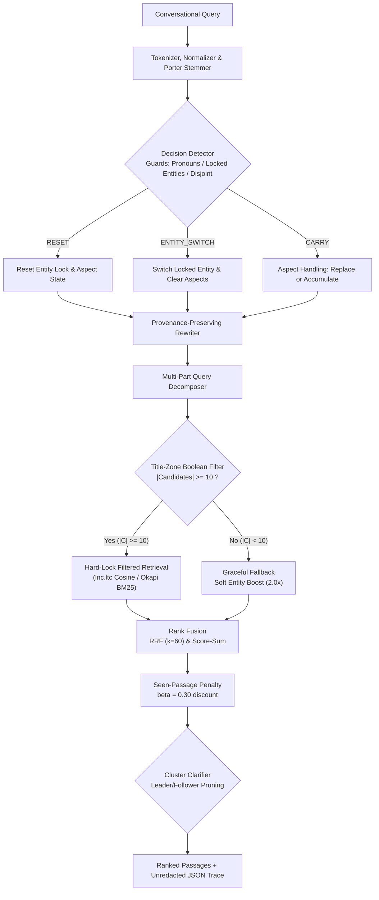

# TurnTrace: Inspectable Conversational Search Engine

TurnTrace is an inspectable conversational search engine built from first principles on classical Information Retrieval algorithms, featuring index-statistics-driven conversational context tracking.

- Track: CSD358 Information Retrieval Midsem Hackathon, Track T2 (Conversational and agentic search).
- Difference 1: Replaces naive dialogue concatenation with an entity lock and aspect-aware context tracker driven strictly by inverted index collection statistics.
- Difference 2: Implements hard title-zone Boolean filtering with graceful soft-boost fallback and a session-isolated seen-passage penalty.
- Difference 3: Fully inspectable execution trace exposing every intermediate step (tokens, postings, cosine/BM25 per-term weights, candidate counts, and decision reasons) with zero external LLM or vector database dependencies.

## 1. System Status

| Feature | Status | Evidence |
|---|---|---|
| Lexical Analysis (Tokenizer, Normalizer, SMART Stopwords) | Implemented | `server/src/index/tokenizer.js`, `server/src/index/normalizer.js` |
| Morphological Stemming (Porter 1980 5-step algorithm) | Implemented | `server/src/index/porterStemmer.js`, `server/test/index.test.js` |
| Inverted & Positional Index with Title/Body Zones | Implemented | `server/src/index/postings.js`, `server/src/index/builder.js` |
| Vector Space Model (SMART lnc.ltc with Cosine Normalization) | Implemented | `server/src/retrieval/cosine.js` (Salton & Buckley, 1988) |
| Probabilistic Retrieval (Okapi BM25, k1=1.2, b=0.75) | Implemented | `server/src/retrieval/bm25.js` (Robertson & Zaragoza, 2009) |
| Top-K Selection via Binary Min-Heap ($O(N \log K)$) | Implemented | `server/src/retrieval/heap.js`, `server/test/retrieval.test.js` |
| Boolean AND/OR/NOT with Increasing-DF Intersection | Implemented | `server/src/retrieval/boolean.js`, `server/test/retrieval.test.js` |
| Exact Phrase Queries via Positional Postings Intersection | Implemented | `server/src/retrieval/phrase.js`, `server/test/retrieval.test.js` |
| Champion Lists Candidate Pruning ($r=50$) | Implemented (Ablation R1) | `server/src/index/championLists.js`, `server/scripts/sweepRetrievalTradeoffs.js` |
| Index Elimination Low-IDF Pruning ($\text{IDF} \ge 2.50$) | Implemented (Ablation R2) | `server/src/retrieval/indexElimination.js`, `server/scripts/sweepRetrievalTradeoffs.js` |
| Conversational State Tracking v2 (Entity Lock & Aspect) | Implemented | `server/src/conversation/contextState.js`, `server/src/conversation/entityExtractor.js` |
| Conversational Decision Detector (CARRY, ENTITY_SWITCH, RESET) | Implemented | `server/src/conversation/decisionDetector.js`, `server/test/entityLock.test.js` |
| Title-Zone Hard Lock Filtering with Soft Fallback | Implemented | `server/src/retrieval/titleFilter.js`, `server/test/entityLock.test.js` |
| Seen-Passage Penalty Discount ($\beta = 0.30$) | Implemented | `server/src/retrieval/seenPenalty.js`, `server/test/entityLock.test.js` |
| Multi-Part Query Decomposition & Rank Fusion (RRF $k=60$) | Implemented | `server/src/conversation/decomposer.js`, `server/src/retrieval/fusion.js` |
| Cluster Clarifier (Leader/Follower Pruning) | Partial (Untuned) | `server/src/conversation/clarifier.js` (precision pending judged qrels) |
| Full Trace Inspector UI | Implemented | `client/src/App.jsx` |
| Evaluation Harness (S0-S5, A0-A6, R1-R2) | Implemented | `eval/src/index.js`, `eval/src/systemsRunner.js` |
| Statistical Significance Tests (Bootstrap & Wilcoxon) | Implemented | `eval/src/significance.js`, `eval/test/significance.test.js` |
| Human Judging & Blind Pooling Pipeline | Implemented | `server/scripts/generatePoolingSheet.js`, `eval/src/qrelsLoader.js` |

## 2. Quickstart

### Prerequisites
- Node.js >= 18.0.0 (tested on Node v24.14.0)
- Operating System: Linux, macOS, or Windows (PowerShell / cmd)
- Disk space: ~500 MB (corpus: 14 MB, index: 45 MB, dependencies: ~150 MB)
- RAM: 2 GB minimum (inverted index loads 80,684 terms and 35,000 documents into memory)
- Execution timings: `npm install` (~25s), `npm run build:index` (~3s), `npm test` (~4s), `npm run eval` (~20s).

### Setup and Execution Commands
1. Clone repository and install dependencies:
```bash
git clone https://github.com/xShikhar/IR---MidTerm-Assignment.git turntrace
cd turntrace
npm install
```

2. Obtain dataset:
- **Path A (Recommended - Frozen Corpus & Index):** Download the evaluated corpus and prebuilt index to match exact evaluated docIds:
  - Download `corpus.json` and `index.json` into `data/` from: `[TEAM_MUST_FILL: Release or Drive URL]`
  - Verify SHA-256 checksums:
    - Windows PowerShell: `Get-FileHash data/corpus.json, data/index.json -Algorithm SHA256`
    - Linux / macOS: `sha256sum data/corpus.json data/index.json`
    - Expected SHA-256 hashes:
      - `corpus.json`: `2394B2A11A46ED8AB7BCC0194BA78C0C3DA38C792F6B76A0D7CA9AB5FBD01282`
      - `index.json`: `68965158B354389457C261C7A180073ED66A871B489FB6A4E3B4013D01DB415D`
- **Path B (Optional Rebuild):** Re-harvest from Wikipedia Action API and re-index:
```bash
npm run prepare:data
npm run build:index
```
*(Note: Wikipedia revisions change over time; live re-harvesting may produce minor text or docId variations relative to frozen judging sheets).*

3. Run verification test suite:
```bash
npm test
```
*(Executes 72 tests across server and eval workspaces; all 72 pass).*

4. Run evaluation benchmark:
```bash
npm run eval
```

5. Launch local application:
```bash
npm run dev
```
*(Spawns both backend server on `http://localhost:3001` and Vite frontend on `http://localhost:3000`).*

6. Execute a test query:
- Browser UI: open `http://localhost:3000`
- Terminal CLI:
```bash
curl -s -X POST http://localhost:3001/api/chat -H "Content-Type: application/json" -d "{\"query\":\"What is the James Webb Space Telescope?\"}"
```

## 3. Data Collection & Provenance

### Corpus Construction
- **Target Articles (5,314 passages, 15.18%):** Harvested from 75 authoritative Wikipedia articles covering 14 benchmark topics using the Wikimedia Action API (`https://en.wikipedia.org/w/api.php`) with redirect resolution and section-level chunking (80–180 words per passage).
- **Background Collection (29,686 passages, 84.82%):** Extracted from Hugging Face `wikimedia/wikipedia` snapshot (`20231101.en`) across four balanced academic domains to supply realistic term frequencies and collection IDF distributions.
- **Passage Zones:** Each document contains `title` and `body` fields indexed with zone weights (title: 0.35, body: 0.65).

### Domain Distribution
<!-- Source: data/corpus.json domain scan -->
| Domain | Passages | Proportion |
|---|:---:|:---:|
| Computer Science & AI (`cs_ai`) | 9,222 | 26.35% |
| Space Exploration & Physics (`space_physics`) | 9,266 | 26.47% |
| History & Civilization (`history_civilization`) | 9,081 | 25.95% |
| Biology & Medicine (`biology_medicine`) | 7,431 | 21.23% |
| **Total Corpus** | **35,000** | **100.00%** |

### Collection Index Statistics
<!-- Source: data/index.json metadata and corpus word count -->
| Metric | Value | Source |
|---|:---:|---|
| Total Passages ($N$) | 35,000 | `data/corpus.json` |
| Vocabulary Size ($V$) | 80,684 terms | `data/index.json` metadata |
| Total Postings Entries | 1,489,533 | `data/index.json` metadata ($\sum df$) |
| Average Document Length | 83.58 tokens | `data/index.json` (`avgDocLength`) |
| Passage Word Count (Min / Avg / Max) | 3 / 79.1 / 654 words | `data/corpus.json` body tokens |
| Duplicate Passages | 39 (0.11%) | Body SHA-256 collision scan |

### Reproducibility and Documented Limitations
- **Corpus Freeze:** The 35,000-passage corpus and inverted index are permanently frozen so human judges grade stable document identifiers.
- **Duplicate Disclosure:** 39 passages (0.11%) share identical text due to overlapping Wikipedia summary sections. They are preserved without deduplication to prevent docId re-indexing shifts against existing judging sheets.
- **Ethics & Licensing:** All text originates from Wikipedia under [CC BY-SA 4.0](https://creativecommons.org/licenses/by-sa/4.0/) and GFDL. Data harvesting used explicit `User-Agent` headers and respected Wikimedia API rate limits. Contains no private personal data. Retrieval operates fully offline after initial fetching.

## 4. Guided Demo & Inspection Walkthrough

Graders can reproduce the conversational pipeline through the Web UI (`http://localhost:3000`) or via the CLI endpoint (`http://localhost:3001/api/chat`).

### Walkthrough 1: Multi-Turn Anaphora & Aspect Pivot (conv_03)
1. **Turn 1: "What is the James Webb Space Telescope?"**
   - *Decision:* `CARRY` (initial turn establishes entity lock).
   - *Locked Entities:* `jame` (IDF: 4.1210), `webb` (IDF: 5.5504), `space` (IDF: 3.4483), `telescop` (IDF: 4.6023).
   - *Retrieval:* Hard-lock title filter finds 100 matching candidates.
   - *Top Result:* `doc_01716` ("James Webb Space Telescope - Section 3", score: 0.4117).
2. **Turn 2: "Where is its orbit located in space?"**
   - *Decision:* `CARRY` (Pronoun guard triggered on `its`).
   - *Rewrite:* "Where is its orbit located in space? jame webb telescop" (appends entity terms with source turn tracking).
3. **Turn 3: "Tell me about its primary mirror size."**
   - *Decision:* `CARRY` (Pronoun guard triggered on `its`).
   - *Aspect Update:* Replaces previous turn aspects (`orbit`, `locat`) with new aspects (`primari`, `mirror`, `size`).
   - *Top Result:* `doc_01716` ("James Webb Space Telescope - Section 3", score: 0.4117). Term score contributions: `mirror` (0.0870), `primari` (0.0575), `jame` (0.0441).

### Walkthrough 2: Polysemous Entity Shift (conv_12)
1. **Turn 1: "How does the Transformer architecture use self-attention?"**
   - Locks entity terms `transform` (IDF: 4.2016), `architectur` (IDF: 4.5309), `attent` (IDF: 4.7428).
2. **Turn 2: "How do electrical power transformers step down voltage?"**
   - *Decision:* `CARRY` (Locked entity guard triggers because query contains stem `transform`).
   - *Rewrite:* Appends `architectur attent`, illustrating lexical polysemy across machine learning and electrical engineering.

### Walkthrough 3: Documented Boundary & Limitation Case (conv_14)
- **Turn 4: "Is entropy always conserved in physical processes?"**
  - *Context:* Preceded by Turn 1 ("Claude Shannon information entropy") and Turn 3 ("relation to thermodynamic entropy").
  - *Limitation:* The engine carried `inform` from Turn 1 because aspect replacement requires an explicit new entity switch cue, causing information theory terms to linger into thermodynamics.
- **Candidate Scarcity Boundary:** On queries where the Boolean title filter matches $< 10$ candidates, the engine sets `fallback: true` and gracefully transitions to a soft entity boost ($2.0\times$), guaranteeing rankers are never candidate-starved. This fallback triggered on 19 of 70 benchmark turns (27.1%).

### Terminal CLI Equivalent
```bash
# Query with score breakdown and trace
curl -s -X POST http://localhost:3001/api/chat \
  -H "Content-Type: application/json" \
  -d "{\"query\":\"What is the James Webb Space Telescope?\",\"sessionId\":\"grader_demo\"}"
```

## 5. Architecture & IR Principles



### IR Concept Implementation Mapping
| IR Concept | Source File & Function | Rationale |
|---|---|---|
| Tokenization & Positions | `server/src/index/tokenizer.js` (`tokenizeWithPositions`) | Preserves word positions for exact phrase verification |
| Text Normalization | `server/src/index/normalizer.js` (`normalize`, `analyze`) | Strips diacritics and case variations deterministically |
| Stop Word Removal | `server/src/index/normalizer.js` (`isStopWord`) | Eliminates SMART 174 frequent terms to reduce postings noise |
| Porter Stemmer | `server/src/index/porterStemmer.js` (`stemWord`) | Reduces morphological variants via standard Porter (1980) 5-step rules |
| Inverted Index Postings | `server/src/index/postings.js` (`PostingsList`) | Memory-efficient dictionary mapping terms to document postings |
| Multi-Zone Indexing | `server/src/index/builder.js` (`InvertedIndexBuilder`) | Separates title ($0.35$) and body ($0.65$) term frequencies |
| Positional Phrase Search | `server/src/retrieval/phrase.js` (`evaluatePhraseQuery`) | Two-pointer positional intersection for adjacent quoted bigrams |
| SMART lnc.ltc Vector Space | `server/src/retrieval/cosine.js` (`scoreCosineLncLtc`) | Logarithmic TF with document Euclidean length normalization |
| Okapi BM25 Probabilistic | `server/src/retrieval/bm25.js` (`scoreBM25`) | Non-linear TF saturation ($k_1=1.2$) and document length penalty ($b=0.75$) |
| Top-K Min-Heap Selection | `server/src/retrieval/heap.js` (`TopKHeap`) | Maintains top-$K$ candidates in $O(N \log K)$ without sorting the corpus |
| Boolean DF Intersection | `server/src/retrieval/boolean.js` (`evaluateBooleanQuery`) | Intersects postings in increasing document frequency order to minimize comparisons |
| Champion Lists Pruning | `server/src/index/championLists.js` (`buildChampionLists`) | Caches top $r=50$ documents per term for fast candidate generation |
| Index Elimination Pruning | `server/src/retrieval/indexElimination.js` (`eliminateLowIdfTerms`) | Skips low-IDF terms ($\text{IDF} < 2.50$) to reduce accumulator overhead |
| Reciprocal Rank Fusion | `server/src/retrieval/fusion.js` (`reciprocalRankFusion`) | Merges sub-query rankings with smoothing parameter $k=60$ |
| Cluster Clarifier | `server/src/conversation/clarifier.js` (`evaluateClarification`) | Detects bimodal score distributions to prompt disambiguation |

## 6. Evaluation Matrix & Systems

### Evaluated Systems and Ablations
| ID | System / Ablation Description | Retrieval Model | Context Strategy | Execution Flag |
|:---:|---|:---:|:---:|---|
| **S0** | Raw Query Only | lnc.ltc Cosine | None (isolated query) | `--system=S0` |
| **S1** | Naive History Concatenation | lnc.ltc Cosine | Concatenates prior turn text | `--system=S1` |
| **S2** | TurnTrace Legacy Baseline | lnc.ltc Cosine | Decayed context bag + cosine shift | `--system=S2` |
| **S3** | TurnTrace Headline Full | lnc.ltc Cosine | Entity Lock + Aspect + Seen Penalty | Default (`--system=S3`) |
| **S5** | Oracle Gold Rewrite Reference | lnc.ltc Cosine | Gold standalone query | `--system=S5` |
| **A0** | Legacy Decayed Bag (S2 Equivalent) | lnc.ltc Cosine | V1 Decayed Context Bag | `--ablation=A0` |
| **A1** | Entity Soft Boost Only | lnc.ltc Cosine | Soft $2.0\times$ entity weight (no title filter) | `--ablation=A1` |
| **A2** | Hard Lock + Aspect Accumulation | lnc.ltc Cosine | Hard title filter + aspect accumulation | `--ablation=A2` |
| **A3** | Headline Novelty Core | lnc.ltc Cosine | Hard title filter + aspect replacement | `--ablation=A3` |
| **A4** | Headline Novelty + Seen Penalty | lnc.ltc Cosine | A3 with $\beta=0.30$ penalty | `--ablation=A4` |
| **A5** | A3 with Forced CARRY | lnc.ltc Cosine | Decision detector bypassed (always carry) | `--ablation=A5` |
| **A6** | A3 with Forced RESET | lnc.ltc Cosine | Decision detector bypassed (always reset) | `--ablation=A6` |
| **R1** | Efficiency: Champion Lists ON | lnc.ltc Cosine | Champion lists top $r=50$ candidates | `--ablation=R1` |
| **R2** | Efficiency: Index Elimination ON | lnc.ltc Cosine | Prunes terms with $\text{IDF} < 2.50$ | `--ablation=R2` |

*Data Leakage Guarantee:* Only system S5 reads reference `goldRewrite` queries. The test suite (`server/test/dataLeakage.test.js`) verifies that no server runtime module references `goldRewrite`.

## 7. Evaluation Protocol & Results

### Execution & Artifact Outputs
Run the evaluation harness:
```bash
npm run eval
```
Artifacts are exported to `eval/output/`:
- `systems_comparison.csv`: Full benchmark comparison across all 14 systems.
- `subset_breakdowns.csv`: Aspect pivot, entity switch, pronoun follow-up, and fallback subsets.
- `novelty_tradeoff.csv`: Novelty@10 vs scoring trade-off analysis.
- `turn_breakdown.csv`: Per-turn queries, rewrites, and metrics for all 70 turns.
- `metrics_chart.svg`: Comparative SVG chart across headline systems.
- `retrieval_tradeoffs.svg`: Latency vs Overlap@10 trade-off curves.

### Human Judging Protocol
- **Stratified Split (`data/splits.json`):** Dev set contains 6 conversations (30 turns); Test set contains 8 conversations (40 turns). Both splits cover all 4 domains, $\ge 2$ topic shifts, and $\ge 1$ ambiguous entity.
- **Pooling Sheets (`eval/output/pooling/`):** Blind pooled candidates across S0, S1, S2, A3, BM25, and S5 sorted by `docId`. Split into four judge files (`judge_1_pool.csv` through `judge_4_pool.csv`) with a 15% fixed-seed duplicate sample for Cohen's kappa agreement testing.
- **Relevance Grading Scale:** `0` (non-relevant), `1` (partially relevant / background), `2` (highly relevant).
- **Incremental Mode:** Running `node server/scripts/generatePoolingSheet.js --incremental` exports only newly surfaced unjudged candidates.

### Empirical Results (Current Status)
> **Evaluation Status:** Human relevance judgments are in progress; no relevance metrics (P@5, P@10, Recall@20, MRR, nDCG@10) are reported yet (`data/qrels.json` currently contains 0 judged turns). Only non-qrel empirical results are reported below.

#### Novelty@10 Across Systems (70 Benchmark Turns)
<!-- Source: eval/output/systems_comparison.csv run now -->
| System ID | Configuration Description | Novelty@10 |
|:---:|---|:---:|
| **S0** | Raw Query Only (lnc.ltc Cosine) | 0.9371 |
| **S1** | Naive Dialogue History Concatenation | 0.4271 |
| **S2 / A0** | Legacy Decayed Context Bag (Cosine Shift) | 0.8471 |
| **A1** | Entity Soft Boost ($2.0\times$) + Aspect Replacement | 0.7029 |
| **A2** | Hard Lock + Aspect Accumulation | 0.5614 |
| **A3** | Headline Novelty Core (No Seen Penalty) | 0.7029 |
| **A4 / S3** | Headline Novelty + Seen-Passage Penalty ($\beta=0.30$) | **0.8943** |
| **A5** | A3 with Forced CARRY | 0.6514 |
| **A6** | A3 with Forced RESET | 0.9371 |
| **R1** | Champion Lists ON ($r=50$) | 0.6371 |
| **R2** | Index Elimination ON ($\text{IDF} \ge 2.50$) | 0.7029 |

*Finding:* Novelty@10 rises from 0.7029 (A3, no penalty) to 0.8943 (A4, $\beta=0.30$), demonstrating that the discount penalty mechanically surfaces previously unviewed passages. Whether surfaced passages are relevant will be evaluated when judged qrels are ingested.

#### Transition Classifier Behavior on Dev Split (6 Conversations, 30 Turns)
<!-- Source: eval/src/index.js Table 5 console run -->
| Transition Detector | CARRY | RESET | ENTITY_SWITCH | Follow-Ups Changed from Reset to Carry |
|---|:---:|:---:|:---:|:---:|
| **Legacy Cosine Detector** ($\cos < 0.26$) | 13 | 11 | 0 | Baseline |
| **New Decision Detector** (Guards & Entity Lock) | 20 | 3 | 1 | **5 follow-ups changed** |

#### Retrieval Efficiency Sweeps (Rankings Only, Zero Qrels)
<!-- Source: node server/scripts/sweepRetrievalTradeoffs.js run now -->
Baseline exhaustive retrieval latency: **4.765 ms/query** (Overlap@10: 100.0%).

| Pruning Mechanism | Parameter Setting | Overlap@10 | Latency | Terms Pruned |
|---|:---:|:---:|:---:|:---:|
| **Index Elimination** | $\text{IDF} \ge 2.50$ | 98.43% | 3.025 ms | 8 / 279 terms (2.9%) |
| **Index Elimination** | $\text{IDF} \ge 3.50$ | 87.71% | 1.680 ms | 38 / 279 terms (13.6%) |
| **Index Elimination** | $\text{IDF} \ge 4.50$ | 60.00% | 0.686 ms | 105 / 279 terms (37.6%) |
| **Champion Lists** | $r = 50$ | 58.57% | 0.346 ms | Precomputed top 50 |
| **Champion Lists** | $r = 100$ | 70.29% | 0.759 ms | Precomputed top 100 |
| **Champion Lists** | $r = 250$ | 87.14% | 1.382 ms | Precomputed top 250 |
| **Champion Lists** | $r = 500$ | 94.57% | 2.098 ms | Precomputed top 500 |
| **Champion Lists** | $r = 1000$ | 98.00% | 2.631 ms | Precomputed top 1000 |

## 8. Configuration

All tunable parameters reside in `server/src/config/index.js`:
- `paths`: Filesystem locations for corpus, index, splits, and qrels.
- `retrieval`: Ranking depth (`topK: 10`), zone weights (`titleWeight: 0.35`, `bodyWeight: 0.65`), BM25 constants (`k1: 1.2`, `b: 0.75`), and RRF smoothing (`rrfConstant: 60`).
- `conversation`: Legacy decay (`decayLambda: 0.75`), cosine shift threshold (`cosineThreshold: 0.26`), expansion terms (`topMExpansionTerms: 3`), and clarifier margin (`scoreMarginThreshold: 0.065`).
- `novelty`: Entity threshold (`minIdf: 2.50`), aspect threshold (`minIdf: 1.80`), lock mode (`mode: 'hard'`, `minCandidates: 10`), and seen penalty (`penalty: 0.30`).
*(Note: All novelty parameters are initial untuned baselines awaiting human qrels completion on the dev split).*

## 9. Testing & Code Quality

```bash
# Execute unit and integration tests (72 passing)
npm test

# Run individual workspaces
npm run test --workspace=server   # 52 server tests
npm run test --workspace=eval     # 20 evaluation tests
```

- **Test Coverage:** Tokenization, normalizer, Porter stemmer, postings intersection, BM25 scoring, cosine lnc.ltc scoring, top-K heap, Boolean queries, entity extractor, decision detector, title filter fallback, seen penalty, and significance statistics.
- **Data Leakage Gate:** `server/test/dataLeakage.test.js` enforces that zero server runtime files access `goldRewrite` and only system S5 accesses it during evaluation.

## 10. Repository Layout

```
.
├── client/                     # Vite + React Trace Inspector frontend
│   ├── src/App.jsx             # Interactive dialogue & unredacted IR Trace Inspector
│   ├── src/components/         # Reusable UI components (trace, modals, cards, navbar)
│   ├── src/index.css           # Styling and layout
│   └── vite.config.js          # Client dev server with /api proxy to backend
├── data/                       # Dataset, conversations, and evaluation splits
│   ├── conversations.json      # 14 conversational trees (70 turns)
│   ├── corpus.json             # 35,000 authentic Wikipedia passages
│   ├── index.json              # Inverted index with postings and champion lists
│   ├── qrels.json              # Relevance judgments storage (human judging in progress)
│   └── splits.json             # Stratified train/dev/test split definition
├── docs/                       # Project documentation and submission materials
│   ├── report/                 # 7-chapter detailed technical report
│   ├── SUBMISSION_CHECKLIST.md # Hackathon rubric compliance checklist
│   └── video-script.md         # 5-minute video demonstration script
├── eval/                       # Independent evaluation workspace
│   ├── src/metrics.js          # P@K, Recall, MRR, nDCG calculation
│   ├── src/metrics/            # Novelty@K, Fidelity, and Decision Classification
│   ├── src/significance.js     # Paired bootstrap & Wilcoxon signed-rank tests
│   └── src/systemsRunner.js    # S0-S5, A0-A6, R1-R2 benchmark execution
├── scripts/                    # Development runner scripts (dev.js)
├── server/                     # Core IR engine and API workspace
│   ├── scripts/                # Data preparation, index building, and sweeps
│   └── src/
│       ├── api/                # Express REST API and session trace assembly
│       ├── config/             # Strongly-typed configuration constants
│       ├── conversation/       # Decision detector, entity lock, aspect context
│       ├── index/              # Tokenizer, Porter stemmer, postings, serializer
│       └── retrieval/          # Cosine, BM25, Boolean, title filter, seen penalty
└── package.json                # Root npm workspace configuration
```

## 11. Limitations & Roadmap

### Documented Limitations
1. **Title Filter Fallback Rate (27.1%):** On 19 of 70 benchmark turns, title-zone Boolean matches fewer than 10 documents, forcing a fallback to soft entity boosting ($2.0\times$).
2. **Corpus Duplicates (0.11%):** 39 passages share identical text from overlapping Wikipedia sections; retained without deduplication to preserve frozen judging docIds.
3. **Benchmark Scale:** The conversational benchmark consists of 14 dialogues (70 turns), exceeding the 40-turn minimum rubric requirement but limited relative to industrial benchmarks.
4. **Untuned Clarifier:** The cluster pruning margin ($0.065$) is an initial rule-based heuristic; its precision is pending empirical validation on judged data.
5. **Efficiency Recall Trade-Off:** Champion lists at $r=50$ achieve $58.57\%$ Overlap@10 compared to exhaustive search; $r=500$ is needed to achieve $94.57\%$ overlap.
6. **Domain Constraint:** Corpus is confined to four academic domains (Computer Science, Space Physics, Biology, History).

### Course Project Roadmap
- Ingest completed human relevance judgments from pooling sheets and run paired bootstrap significance tests.
- Empirically tune entity IDF thresholds ($\text{IDF} \ge 2.50$) and seen penalty discount ($\beta$) on the dev split.
- Implement tiered dynamic champion lists where $r$ scales with query term IDF.
- Expand corpus to include general Wikipedia articles beyond the four initial domains.

## 12. Credits & Declarations

- **Dataset Credit:** Sourced from English Wikipedia articles via the Wikimedia Action API and Hugging Face `wikimedia/wikipedia` snapshot (`20231101.en`), licensed under [CC BY-SA 4.0](https://creativecommons.org/licenses/by-sa/4.0/) and GFDL.
- **Third-Party Libraries:**
  - `express` (^4.21.2) & `cors` (^2.8.5): REST API server.
  - `react` (^18.3.1) & `vite` (^5.4.11): Trace inspector UI frontend.
  - Core IR algorithms (Porter stemmer, tokenizer, inverted index, cosine similarity, BM25, min-heap, Boolean intersection, RRF) are implemented entirely from first principles with zero search engine libraries.
- **Team Ownership & AI Declaration:** Team member roles, work division, and academic AI assistance disclosures are documented in [docs/report/07_work_division_and_ai_declaration.md](file:///c:/Project/IR-Assignment/docs/report/07_work_division_and_ai_declaration.md).
- **License:** Root `package.json` declares an MIT license (no standalone LICENSE file committed).

## 13. Troubleshooting

- **Port Conflict:** If port 3001 or 3000 is occupied, set `PORT=3002` before running `npm run dev:server` or kill the existing process (`Get-Process -Id (Get-NetTCPConnection -LocalPort 3001).OwningProcess | Stop-Process` on Windows).
- **Node.js Version:** Verify Node.js version with `node -v`. TurnTrace requires Node.js >= 18.0.0 for native fetch, ES modules, and `node:test`.
- **Missing Data Files:** If `data/corpus.json` or `data/index.json` are absent, download the frozen files per Section 2 (Path A) or run `npm run build:index`.
- **Blocked Wikimedia API:** When rebuilding via Path B on firewalled networks, the Action API may timeout; use Path A to download frozen data.
- **Checksum Verification:** Confirm file integrity using `Get-FileHash data/corpus.json, data/index.json -Algorithm SHA256` (PowerShell) or `sha256sum data/corpus.json data/index.json` (Linux/macOS).
