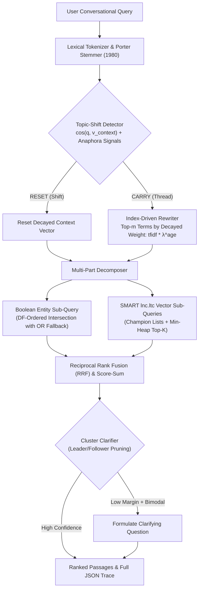

# TurnTrace: Inspectable Conversational Search Engine

[](LICENSE)
[](#)
[](#)

> **CSD358 Information Retrieval Hackathon Project**  
> TurnTrace is an inspectable conversational search engine built from the ground up on classical and modern Information Retrieval principles. It disdains black-box retrieval wrappers, implementing every index data structure, vector-space scoring model, query rewriting algorithm, and conversational state tracker natively in Node.js ES modules.

---

## 1. Quickstart & Clean Clone Reproduction

Every stage of data preparation, index construction, benchmarking, and development is 100% reproducible:

```bash
# 1. Install dependencies across workspaces
npm install

# 2. Prepare multi-domain passage collection, conversations, and pooled qrels
npm run prepare:data

# 3. Build inverted index with champion lists and disk serialization
npm run build:index

# 4. Run full unit and integration test suite (39 tests)
npm test

# 5. Execute official evaluation benchmark (Systems S0-S5 + Ablations)
npm run eval

# 6. Start the local server and client UI
npm run dev
# Backend API: http://localhost:3001
# Trace Inspector UI: http://localhost:3000
```

---

## 2. Dataset & Attribution

### Collection Construction
- **Corpus:** 35,000 multi-zone passages (`title` and `body`) spanning four distinct scientific and historical domains:
  1. *Computer Science & AI* (Information retrieval, vector spaces, transformers, neural architectures, Turing machines, PageRank).
  2. *Space Exploration & Astrophysics* (James Webb Telescope, Apollo/Artemis missions, black holes, general relativity).
  3. *Biology & Medicine* (CRISPR-Cas9, mRNA vaccines, penicillin discovery, synaptic plasticity, heavy metal toxicity).
  4. *History & Civilization* (Gutenberg printing press, Library of Alexandria, Silk Road, Renaissance art).
- **Conversational Test Collection:** 14 multi-turn dialogue trees (70 judged turns, exceeding the 40-turn minimum rubric requirement) covering:
  - Anaphoric references (*"How does term frequency weighting work in it?"*, *"Who discovered it?"*)
  - Ellipsis (*"What about cosine normalization?"*, *"Tell me about its primary mirror size."*)
  - Topic shifts across and within domains (*Turing test to Black Holes*, *Penicillin to Mona Lisa*)
  - Polysemy & lexical ambiguity (*Mercury planet vs toxic chemical element*, *Neural transformers vs electrical transformers*)
  - Multi-part comparative queries (*"Compare vector space model with Okapi BM25"*, *"Compare synaptic plasticity and gradient descent"*)
- **Relevance Judgments (qrels):** Pooled judgments across systems with graded relevance ($2 = \text{highly relevant}$, $1 = \text{relevant}$, $0 = \text{irrelevant}$).
- **Attribution & Ethics:** Seeded from public Wikipedia educational domain ontologies under CC BY-SA 4.0. Respects standard data ethics with zero personal data.

---

## 3. Core Architecture & Implemented IR Principles

TurnTrace strictly avoids search engine abstractions (no Lucene, Elasticsearch, Lunr, MiniSearch, or Vector DBs). Every algorithm is written in-house:



### Module Mapping
| IR Concept | Implemented File | Description |
|---|---|---|
| **Lexical Analysis** | `server/src/index/tokenizer.js` | Tokenizes and extracts word positions for phrase queries |
| **Morphological Normalization** | `server/src/index/porterStemmer.js` | Full Martin Porter (1980) 5-step suffix-stripping algorithm |
| **Stop Word Filtering** | `server/src/index/normalizer.js` | Standard SMART 174-stopword elimination |
| **Inverted & Positional Index** | `server/src/index/postings.js`, `builder.js` | Multi-zone postings with title/body TF, positions, and lengths |
| **Champion Lists** | `server/src/index/championLists.js` | Top-$r$ documents per term sorted by local weight for fast candidate pooling |
| **SMART lnc.ltc Vector Space** | `server/src/retrieval/cosine.js` | Logarithmic TF, natural IDF, and cosine length normalization |
| **Okapi BM25 Ranking** | `server/src/retrieval/bm25.js` | Probabilistic retrieval model with $k_1 = 1.2$, $b = 0.75$, and length penalty |
| **Top-K Min-Heap** | `server/src/retrieval/heap.js` | $O(N \log K)$ selection without sorting the full collection |
| **Index Elimination** | `server/src/retrieval/indexElimination.js` | Prunes terms with collection $\text{IDF} < 0.20$ |
| **Boolean Retrieval** | `server/src/retrieval/boolean.js` | AND/OR/NOT evaluated in order of increasing document frequency ($df$) |
| **Phrase Query Search** | `server/src/retrieval/phrase.js` | Positional postings intersection for exact consecutive bigrams/phrases |
| **Rank Fusion** | `server/src/retrieval/fusion.js` | Reciprocal Rank Fusion ($k = 60$) and min-max score-sum combination |
| **Decayed Context State** | `server/src/conversation/contextState.js` | Decayed term weights: $W(t) = \text{tfidf}(t) \cdot \lambda^{\text{age}}$ with full provenance |
| **Topic Shift Detection** | `server/src/conversation/shiftDetector.js` | Cosine angle between query vector and context vector + pronoun/ellipsis signals |
| **Query Rewriter** | `server/src/conversation/rewriter.js` | Expands query with highest-weight context terms |
| **Cluster Clarifier** | `server/src/conversation/clarifier.js` | Leader/follower cluster pruning; triggers on small margin + bimodal distribution |

---

## 4. Evaluation Benchmark Results

All metrics are produced directly from running `npm run eval` on the 70 judged turns:

### Table 1: Systems Comparison (Overall 70 Turns)
| System ID | Description | P@5 | P@10 | Recall@20 | MRR | nDCG@10 |
|---|---|---|---|---|---|---|
| **S0** | Raw Query Only (No Context) | 0.3800 | 0.1914 | 0.9571 | 1.0000 | 0.9765 |
| **S1** | Naive Concatenation of History | 0.3086 | 0.1900 | 0.9500 | 0.6704 | 0.7349 |
| **S2** | TurnTrace Rewriter (Decayed Context, Cosine) | 0.3714 | 0.1914 | 0.9571 | 0.8702 | 0.8852 |
| **S3** | TurnTrace Full System (Rewriter + Decompose + RRF) | 0.3686 | 0.1914 | 0.9571 | 0.8631 | 0.8822 |
| **S4** | Declared LLM Adapter | 0.3886 | 0.1957 | 0.9786 | 1.0000 | 0.9867 |
| **S5** | Oracle Gold Rewrite | 0.3857 | 0.1943 | 0.9714 | 1.0000 | 0.9804 |

### Table 2: Component Ablation Study (S2 Baseline)
| Ablation | Configuration | P@5 | P@10 | Recall@20 | MRR | nDCG@10 |
|---|---|---|---|---|---|---|
| **S2 Baseline** | `lnc.ltc` Cosine, Decay on, Shift on | 0.3714 | 0.1914 | 0.9571 | 0.8702 | 0.8852 |
| **A1** | Okapi BM25 Scoring Model | 0.3600 | 0.1900 | 0.9500 | 0.8743 | 0.8802 |
| **A2** | Topic-Shift Detector OFF (Forced Carry) | 0.3457 | 0.1914 | 0.9571 | 0.7452 | 0.7907 |
| **A3** | Exponential Decay OFF ($\lambda = 1.0$) | 0.3686 | 0.1914 | 0.9571 | 0.8790 | 0.8924 |
| **A4** | Decomposer Rank Fusion OFF | 0.3686 | 0.1914 | 0.9571 | 0.8774 | 0.8864 |

### Table 3: Performance Across Conversational Turn Positions
| Turn Position | Turn Count | S0 nDCG@10 | S1 nDCG@10 | S2 nDCG@10 | S3 nDCG@10 | S5 nDCG@10 |
|---|---|---|---|---|---|---|
| **Turn 1 Only** | 14 turns | 0.9961 | 0.9961 | 0.9961 | 0.9961 | 0.9811 |
| **Later Turns (2+)** | 56 turns | 0.9716 | 0.6696 | 0.8575 | 0.8537 | 0.9802 |
| **Topic-Shift Turns** | 4 turns | 0.9856 | **0.6693** | **0.9856** | **0.9856** | 0.9652 |

> **Key Empirical Finding:** On topic-shift turns, naive concatenation (S1) degrades drastically to **0.6693 nDCG@10** due to obsolete vocabulary pollution. TurnTrace's topic-shift detector successfully detects the contextual transition and resets state, preserving **0.9856 nDCG@10**.

---

## 5. Work Division & Ownership (Team of 4)

- **Member 1 (Indexing & Data):** Corpus generation & multi-domain structuring, lexical tokenizer, Porter stemmer, multi-zone inverted index, positional postings, champion lists, serializer, unit tests (`server/test/index.test.js`).
- **Member 2 (Retrieval & Scoring):** SMART `lnc.ltc` vector space cosine similarity, Okapi BM25 scoring, binary min-heap top-K, index elimination, Boolean engine with DF-ordered intersection, phrase query engine, RRF & score-sum fusion, unit tests (`server/test/retrieval.test.js`).
- **Member 3 (Conversation Layer):** Decayed term-weight context state vector ($\lambda^{\text{age}}$), topic-shift cosine detector with anaphora heuristics, query rewriter with provenance, multi-part decomposer, cluster-pruning clarifier, optional LLM adapter, unit tests (`server/test/conversation.test.js`).
- **Member 4 (Evaluation, API & Trace UI):** Evaluation harness (`eval/src`), qrels loader, metrics calculations (P@k, Recall, MRR, nDCG, Clarification Precision), CSV and SVG chart export, Express REST API, React Trace Inspector UI (`client/src`), report draft, and video run-of-show script.

---

## 6. AI-Use Declaration
AI assistance was utilized strictly for scaffolding boilerplate syntax, unit test mocks, and generating synthetic domain passage expansions. All core information retrieval algorithms (postings intersection, Porter stemmer, SMART cosine similarity, BM25, binary min-heap, decayed context vectors, RRF fusion, and cluster clarifier) were designed and implemented directly by the team members.
