# Section 2: Rigorous Application of Information Retrieval Principles

TurnTrace is constructed exclusively from core Information Retrieval algorithms implemented in-house in ES modules. Every mathematical formula, data structure, and indexing primitive maps directly to canonical literature.

## 2.1 Complete Architectural Pipeline

```mermaid
flowchart TD
    subgraph Offline_Indexing ["Offline Indexing Stage"]
        Corpus["35,000 Passage Corpus\n(Multi-Zone: Title & Body)"] --> Lexer["Tokenizer & Porter Stemmer\n(server/src/index/tokenizer.js, porterStemmer.js)"]
        Lexer --> InvertedIdx["Inverted & Positional Index\n(server/src/index/builder.js, postings.js)"]
        InvertedIdx --> LengthNorm["Compute Euclidean Norms & BM25 Doc Lengths\n(server/src/index/builder.js)"]
        InvertedIdx --> ChampLists["Precompute Champion Lists (Top-r Postings)\n(server/src/index/championLists.js)"]
        ChampLists --> DiskStore["Serialize to data/index.json\n(server/src/index/serializer.js)"]
    end

    subgraph Online_Query ["Online Conversational Retrieval Stage"]
        UserQ["User Query Turn q_t"] --> QueryLex["Normalize & Stem Query\n(server/src/index/normalizer.js)"]
        QueryLex --> ShiftCheck{"Topic-Shift Detector\ncos(q_t, v_context) + Anaphora Signals\n(server/src/conversation/shiftDetector.js)"}
        
        ShiftCheck -- "RESET" --> ClearContext["Clear Context Vector\n(server/src/conversation/contextState.js)"]
        ShiftCheck -- "CARRY" --> ExpandQ["Index-Driven Rewriter\nTop-m Terms: tfidf * λ^age\n(server/src/conversation/rewriter.js)"]
        
        ClearContext --> Decompose["Query Decomposer\n(server/src/conversation/decomposer.js)"]
        ExpandQ --> Decompose
        
        Decompose --> BoolEval["Boolean Entity Sub-Query\nDF-Ordered Intersection\n(server/src/retrieval/boolean.js)"]
        Decompose --> VecEval["SMART lnc.ltc Vector Retrieval\n(server/src/retrieval/cosine.js)"]
        
        BoolEval --> RankFusion["Reciprocal Rank Fusion (k=60) & Score-Sum\n(server/src/retrieval/fusion.js)"]
        VecEval --> RankFusion
        
        RankFusion --> MinHeap["Top-K Binary Min-Heap Selection\n(server/src/retrieval/heap.js)"]
        MinHeap --> ClarifEngine{"Cluster Clarifier\nLeader/Follower Pruning\n(server/src/conversation/clarifier.js)"}
        
        ClarifEngine -- "Margin < 0.065 & 2+ Clusters" --> GenQuestion["Generate Clarifying Question"]
        ClarifEngine -- "High Margin" --> Output["Final Ranked Documents & JSON Trace\n(server/src/api/traceAssembly.js)"]
        GenQuestion --> Output
    end
```

---

## 2.2 Detailed Mathematical Formulations & File Mapping

### 1. Lexical Analysis and Morphological Normalization
- **Files:** `server/src/index/tokenizer.js`, `server/src/index/porterStemmer.js`, `server/src/index/normalizer.js`
- **Theory:** Raw strings are segmented via regex word boundaries while preserving token offsets for phrase querying. English morphological suffix variation is reduced using Martin Porter's (1980) 5-step rule-based stemmer:
  - Step 1a: Plural noun / verb inflection reduction (`sses` $\to$ `ss`, `ies` $\to$ `i`).
  - Step 1b: Past tense / progressive endings (`eed`, `ed`, `ing`).
  - Step 1c: $Y$-replacement (`y` $\to$ `i`).
  - Steps 2–4: Derivational suffixes (`ational`, `icate`, `alize`, `ence`, `able`).
  - Step 5: Terminal $e$ deletion and double consonant simplification.
- Standard 174 SMART stop words are eliminated during standard vector querying while retained during exact phrase matching.

### 2. Multi-Zone Inverted and Positional Postings Index
- **Files:** `server/src/index/postings.js`, `server/src/index/builder.js`
- **Theory:** Documents are indexed across two distinct zones: `title` and `body`. Each posting $P_{t,d}$ records:
  - Total term frequency $tf_{t,d} = tf_{t,d,title} + tf_{t,d,body}$.
  - Separate zone frequencies for weighted zone scoring ($g \cdot Score_{title} + (1-g) \cdot Score_{body}$).
  - Exact positional word offsets $[pos_1, pos_2, \dots]$ enabling exact phrase evaluation via positional intersection ($|pos_2 - pos_1| = 1$).

### 3. SMART Vector Space Model (`lnc.ltc`)
- **File:** `server/src/retrieval/cosine.js`
- **Theory:** Implements Salton & Buckley's (1988) canonical `lnc.ltc` vector space cosine similarity:
  $$\text{Document Weight (lnc):} \quad w_{t,d} = \frac{1 + \ln(tf_{t,d})}{\sqrt{\sum_{t' \in d} (1 + \ln(tf_{t',d}))^2}}$$
  $$\text{Query Weight (ltc):} \quad w_{t,q} = \frac{(1 + \ln(tf_{t,q})) \cdot \ln(N / df_t)}{\sqrt{\sum_{t' \in q} ((1 + \ln(tf_{t',q})) \cdot \ln(N / df_{t'}))^2}}$$
  $$\text{Cosine Score:} \quad \text{Score}(d, q) = \sum_{t \in q \cap d} w_{t,q} \cdot w_{t,d}$$

### 4. Okapi BM25 Probabilistic Ranking
- **File:** `server/src/retrieval/bm25.js`
- **Theory:** Compared as an alternative probabilistic baseline (Robertson & Zaragoza, 2009):
  $$\text{Score}_{BM25}(d, q) = \sum_{t \in q} \ln\left(1 + \frac{N - df_t + 0.5}{df_t + 0.5}\right) \cdot \frac{tf_{t,d} \cdot (k_1 + 1)}{tf_{t,d} + k_1 \cdot \left(1 - b + b \cdot \frac{L_d}{L_{avg}}\right)}$$
  with $k_1 = 1.2$, $b = 0.75$, $L_d$ as passage token length, and $L_{avg} = 79.76$ as collection average.

### 5. Efficient Top-K Selection via Binary Min-Heap
- **File:** `server/src/retrieval/heap.js`
- **Theory:** Avoids sorting all $N=35,000$ documents ($O(N \log N)$). Maintains a min-heap of size $K$. Inserting each non-zero scoring document executes in $O(\log K)$, reducing overall candidate selection time to $O(N_{active} \log K)$.

### 6. Index Elimination and Precomputed Champion Lists
- **Files:** `server/src/retrieval/indexElimination.js`, `server/src/index/championLists.js`
- **Theory:** Terms with $\text{IDF} < 0.20$ are pruned during index elimination (Manning et al., §7.1.2). For candidate gathering, champion lists precompute the top $r=50$ documents per term sorted by local weight $w_{t,d} = 1 + \ln(tf_{t,d})$ (§7.1.3).

### 7. Boolean Retrieval with Document Frequency Ordering
- **File:** `server/src/retrieval/boolean.js`
- **Theory:** For multi-term conjunctions ($t_1 \land t_2 \land \dots \land t_m$), terms are sorted by increasing document frequency ($df_{t_1} \le df_{t_2} \dots$), ensuring that the smallest postings lists are intersected first, minimizing intermediate memory and pointer sweeps (§1.3).

### 8. Reciprocal Rank Fusion (RRF)
- **File:** `server/src/retrieval/fusion.js`
- **Theory:** Combines multi-query candidate rankings (Cormack et al., SIGIR 2009):
  $$\text{RRF}(d) = \sum_{m \in M} \frac{1}{60 + r_m(d)}$$
  where $r_m(d)$ is document $d$'s 1-based rank in sub-query list $m$.
